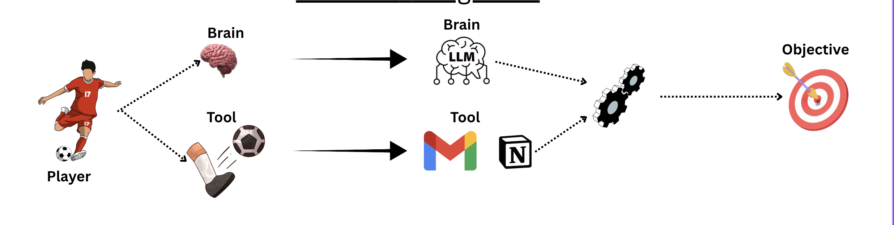
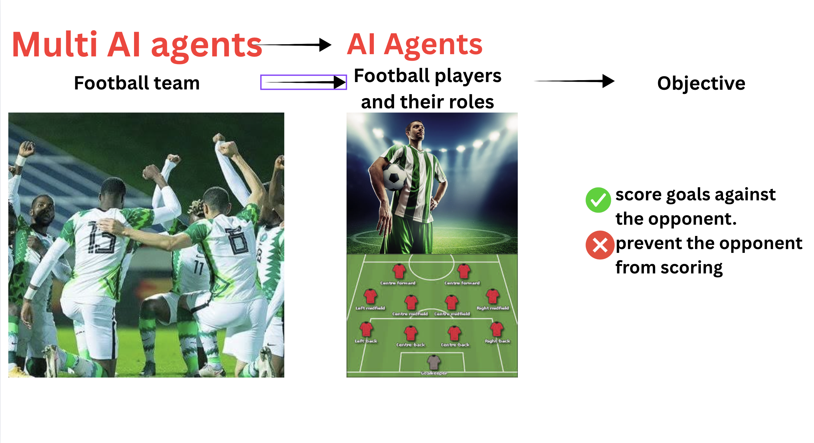
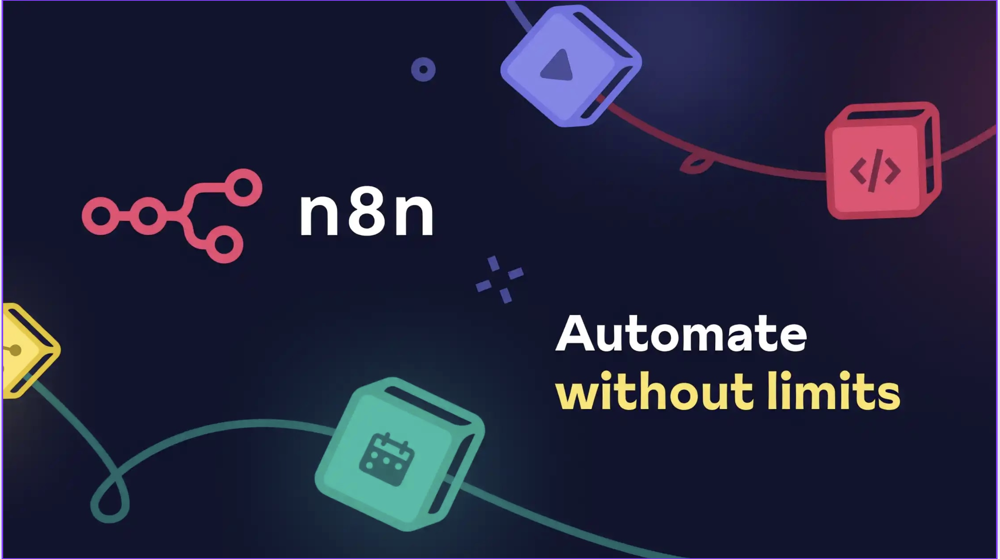
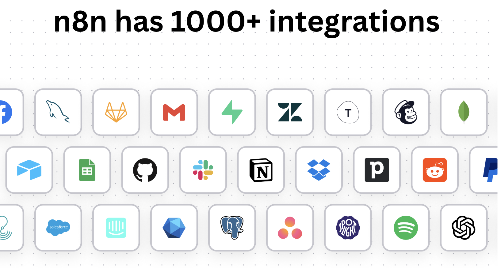

# Visual Automation with n8n & Make

**By: Ashu Mishra**  
**LinkedIn:** [https://www.linkedin.com/in/ashumish/](https://www.linkedin.com/in/ashumish/)  
**Role:** Technical Product Manager

---

## 📋 Agenda

1. **Overview of AI Agents**
2. **Basic Principles of AI Agents**
3. **About n8n**
4. **Nodes and Their Use**
5. **Introduction to Make.com**

---

## 🎯 Real-World Problem #1: Job Search and Job Applications

### The Challenge: What it Takes to Land the Perfect Job

[Video of the solution](https://www.linkedin.com/posts/ashumish_%F0%9D%97%A7%F0%9D%97%B5%F0%9D%97%B2-%F0%9D%97%9B%F0%9D%97%B6%F0%9D%97%B1%F0%9D%97%B1%F0%9D%97%B2%F0%9D%97%BB-%F0%9D%97%96%F0%9D%97%BC%F0%9D%98%80%F0%9D%98%81-%F0%9D%97%BC%F0%9D%97%B3-%F0%9D%97%9D%F0%9D%97%BC-activity-7361245123734622208-9p4W?utm_source=share&utm_medium=member_desktop&rcm=ACoAABHCSikB0YzChF0qz1x6mFTkfZKOtGMNYsI)

**The Traditional Process:**

- ⏰ Endless hours searching job portals
- 🔍 Manually searching for recruiter contact information
- ✍️ Creating personalized cover letters and resumes for each application

### What This Leads To

- ❌ Unsuccessful attempts leading to frustration
- ⌛ Lack of time for proper preparation
- 📄 Non-tailored resumes and cover letters

### 🤖 The Solution: An AI Agent That Can

**Imagine an agent that:**

- Searches all relevant jobs for you from job portals
- Finds contact information for recruiters
- Creates customized resumes and cover letters

### The Job Automation Agent

**Components:**

- 🔗 LinkedIn + Indeed job scraper
- ✉️ Cover letter generator
- 📋 Personalized resume creator

---

## 🍽️ Real-World Problem #2: Sticking to Your Diet

### The Challenge: Maintaining Your Calorie Count

[Video of the solution](https://www.linkedin.com/posts/ashumish_%F0%9D%97%9C-%F0%9D%97%9D%F0%9D%98%82%F0%9D%98%80%F0%9D%98%81-%F0%9D%97%95%F0%9D%98%82%F0%9D%97%B6%F0%9D%97%B9%F0%9D%98%81-%F0%9D%97%AE%F0%9D%97%BB-%F0%9D%97%94%F0%9D%97%9C-%F0%9D%97%A1%F0%9D%98%82%F0%9D%98%81%F0%9D%97%BF%F0%9D%97%B6%F0%9D%98%81%F0%9D%97%B6%F0%9D%97%BC%F0%9D%97%BB%F0%9D%97%B6%F0%9D%98%80%F0%9D%98%81-activity-7363781851187998720-2keU?utm_source=share&utm_medium=member_desktop&rcm=ACoAABHCSikB0YzChF0qz1x6mFTkfZKOtGMNYsI)

**What It Takes:**

- 📊 Tracking diet and its calorific value
- 📝 Maintaining past meal history
- 🧮 Calculating daily calorie allowance

### What Actually Happens

- ❌ Never able to stick to the plan
- 🔍 Can't check calories on Google before every meal
- 🧮 Need to back-calculate meals for the day

### 🤖 The Solution: Nutrition Agent

**An AI Agent that:**

- 📸 Gives you calories in real-time by analyzing food pictures
- 💾 Stores all your meal history
- 🎯 Calculates residual calories and provides recommendations

---

## 💡 Why Learn Creating AI Agents?

### Career Benefits

- 🚀 **Makes you stand out from the crowd**
- 📈 **Growth in career**
- ⚡ **Quick prototyping capabilities**
- 🎨 **Enables proactive product design**
- ✨ **Enhanced user experience**
- 💰 **Lower costs for developing MVP**
- 🤖 **Automates less cognitive and repetitive tasks**

---

## 🧠 What Are AI Agents?

### The Football Analogy



**Think of it like a football team:**

| Component | Football Team | AI Agent |
|-----------|--------------|----------|
| **Player** | Football player | AI Agent |
| **Brain** | Strategy & Decision | AI Model |
| **Tool** | Ball, Skills | APIs, Functions |
| **Objective** | Score goals | Complete task |

### How AI Agents Work

```
Trigger → Action → Result
```

**Example:**

- **Trigger:** Ball comes in
- **Action:** Player kicks the ball
- **Brain:** Decides angle and force
- **Tool:** Foot technique
- **Result:** GOAL! ⚽

---

## 🏆 Multi AI Agent Systems

### The Team Approach


**Objective:** Score goals against the opponent & prevent opponent from scoring

**Football Team:**

- ⚽ Forward (Striker Agent)
- 🎯 Midfielder (Coordinator Agent)
- 🛡️ Defender (Protection Agent)
- 🥅 Goalkeeper (Last-line Agent)

**Each player has:**

- A specific role
- Works with the team
- Uses specific tools
- Shares the same objective

---

## 🔧 How to Create AI Agents

### Coding Knowledge Spectrum

```
Low Code                                    High Code
├─────────────────────────────────────────────────┤
│                                                  │
│  n8n, Make.com                    Python, JS    │
│  (Visual Builders)                (Code-based)  │
└──────────────────────────────────────────────────┘
```

**This course focuses on:** Low Code / No Code Solutions (n8n)

---

## 🎨 What is n8n?



### Definition

**n8n is a low-code automation tool** that allows you to build workflows as visual diagrams.

### Key Features

- 🔗 **1000+ integrations**
- 🎯 **Visual workflow builder**
- 🔄 **Automation-first design**
- 💻 **Code when you need it**

---

## 🌟 Why Should You Learn n8n?

### 1. 👥 Empowering Non-Developers with AI Automation
>
> **You don't need to know how to code!**

### 2. 🔌 Access to 300+ Built-in Integrations

- Google Apps
- Microsoft Apps
- Slack
- Twitter/X
- And many more...

### 3. 🌐 Connect to Almost Any Tool

- Extend using APIs
- Use webhooks
- Add custom code when needed
- **String them together = Infinite possibilities!**


---

## ⚙️ Benefits of Automating Workflows

### Business Impact

- ⚡ **Increases Efficiency**
- ⏰ **Time & Cost Saving**
- 📈 **Scalability**
- 🔍 **Improved Error Handling**
- 😊 **Enhanced Customer Experience**

---

## 🚀 Setting Up n8n

### Two Deployment Options

#### 1. 🏠 Self-Hosted

**Pros:**

- ✅ Full control and flexibility
- ✅ Data ownership
- ✅ Cost-effective at scale
- ✅ Complete customization

**Cons:**

- ⚠️ Requires installation and maintenance
- ⚠️ Need technical knowledge

#### 2. ☁️ Cloud (Recommended for Beginners)

**Pros:**

- ✅ Ease of use
- ✅ High availability and reliability
- ✅ Built-in security
- ✅ Managed data handling
- ✅ No maintenance required

**Cons:**

- ⚠️ Subscription cost
- ⚠️ Less customization

### 📚 For This Session: We'll Use **Cloud Setup**

---

## 🖥️ n8n Interface Overview

### Main Components

1. **Canvas** - Where you build workflows
2. **Node Panel** - Available nodes and integrations
3. **Workflow Controls** - Execute, save, activate
4. **Settings** - Configuration options

---

## 📦 Types of Nodes in n8n

### 1. 🎬 Trigger Nodes

**What they do:**
These tell n8n **when/how to start** the workflow

**Types:**

- 🖱️ Manual Trigger
- ⏰ Scheduled Trigger
- 💬 On Chat Message
- 📢 On Event
- 🔗 Called by Another Workflow

### 2. ⚙️ Action Nodes

**What they do:**
The **doers** - they perform specific tasks

**Types:**

- 📧 Send Email
- 📝 Create Record
- 🌐 Make API Request
- 💬 Get Text Messages
- 📅 Set Calendar Event

### 3. 🔄 Data Transformation Nodes

**What they do:**
Change or process the data flowing through

**Types:**

- **Set:** Add fields, change values, reduce data
- **Aggregate:** Combines data into a single output
- **Merge:** Combining data from two sources

### 4. 💻 Core Nodes

**What they do:**
Require syntax of Java/Python to run

**Types:**

- **Code Node:** Write custom JavaScript/Python
- **HTTP Request:** Make API calls
- **Webhook:** Receive external data

---

## 📝 Getting Started: Signing into n8n

### Step-by-Step Guide

1. **Go to:** [https://n8n.io](https://n8n.io)
2. Click **"Sign in"**
3. Press **"Start a free trial"**
4. Fill in your details and submit
5. Wait for workspace setup (may take some time)
6. **You're in!** 🎉

---

## 💼 Practical Example: Lead Management System

### Problem Statement

**Scenario:**
You run a product consultancy that tests and consults on website functionality and funnels.

**Current Process:**

- Clients fill out a Google Form on your website
- Sales reps need to call them for further inquiry
- You need to track which leads have been called by end of day

**Challenge:**
How do we automate lead tracking and follow-up verification?

---

## 🔗 Resources and References

### Make.com Academy

[Make Academy Enrollments](https://academy.make.com/enrollments)

### Make.com Search

[Make Academy Search](https://academy.make.com/pages/search)

---

## 🎓 Learning Path

### Beginner Level

1. ✅ Understand what AI agents are
2. ✅ Learn the basics of n8n
3. ✅ Create your first simple workflow
4. ✅ Connect 2-3 apps together

### Intermediate Level

1. 📊 Work with data transformations
2. 🔄 Build multi-step workflows
3. 🧪 Test and debug workflows
4. 🔗 Use APIs and webhooks

### Advanced Level

1. 💻 Add custom code nodes
2. 🤖 Build complex AI agent systems
3. 🔐 Handle authentication and security
4. 📈 Scale and optimize workflows

---

## 💡 Best Practices

### Workflow Design

- ✅ Start simple, then expand
- ✅ Test each node individually
- ✅ Use descriptive names for nodes
- ✅ Add notes for complex logic
- ✅ Handle errors gracefully

### Performance

- ⚡ Minimize API calls
- 💾 Cache data when possible
- 🔄 Use batch operations
- ⏰ Schedule workflows efficiently

### Security

- 🔐 Use credentials properly
- 🔒 Don't expose API keys
- ✅ Validate input data
- 🛡️ Implement rate limiting

---

## 🌟 Real-World Use Cases

### 1. Marketing Automation

- 📧 Email campaign management
- 📱 Social media posting
- 📊 Lead scoring and routing

### 2. Data Processing

- 📈 Report generation
- 🔄 Data synchronization
- 🧹 Data cleaning and enrichment

### 3. Customer Support

- 🎫 Ticket management
- 💬 Chatbot integration
- 📞 Call routing

### 4. DevOps

- 🚀 Deployment automation
- 🔔 Incident management
- 📊 Monitoring and alerts

---

## 🔍 n8n vs Other Tools

### n8n vs Make.com

| Feature | n8n | Make.com |
|---------|-----|----------|
| **Open Source** | ✅ Yes | ❌ No |
| **Self-Hosting** | ✅ Yes | ❌ No |
| **Visual Builder** | ✅ Yes | ✅ Yes |
| **Pricing** | Free (self-host) | Paid plans |
| **Community** | Large | Large |
| **Learning Curve** | Moderate | Easy |

---

## 📚 Additional Resources

### Official Documentation

- [n8n Documentation](https://docs.n8n.io/)
- [n8n Community Forum](https://community.n8n.io/)

### Video Tutorials

- n8n YouTube Channel
- Community tutorials

### Templates

- n8n Workflow Templates
- Community shared workflows

---

## 🎯 Next Steps

1. **Sign up for n8n** (if you haven't already)
2. **Follow the setup guide** above
3. **Create your first workflow**
4. **Join the n8n community**
5. **Share your creations!**

---

## 📧 Connect With Me

**Ashu Mishra**  
Technical Product Manager

- 💼 LinkedIn: [https://www.linkedin.com/in/ashumish/](https://www.linkedin.com/in/ashumish/)
- 📧 Feel free to reach out for questions or collaborations!

---

## 🙏 Acknowledgments

This guide is based on practical experience teaching AI Product Management and building automation workflows. All examples are designed to be beginner-friendly while covering real-world scenarios.

### Key Takeaways

- ✅ AI agents can solve real business problems
- ✅ You don't need coding skills to get started
- ✅ Visual automation tools like n8n democratize AI
- ✅ Start small, think big, scale fast

---

## 📖 Glossary

**AI Agent:** An autonomous software entity that can perceive its environment and take actions to achieve goals.

**Workflow:** A sequence of automated tasks that process data from input to output.

**Node:** A single unit in a workflow that performs a specific action.

**Trigger:** An event that starts a workflow execution.

**Integration:** A connection between n8n and external services.

**Webhook:** A way for apps to send automated messages or information to other apps.

**API:** Application Programming Interface - allows different software to communicate.

---

## 🔄 Workflow Examples

### Example 1: Simple Email Notification

```
Trigger (Manual) 
→ Gmail (Send Email)
```

### Example 2: Lead Processing

```
Google Forms (New Response)
→ Google Sheets (Add Row)
→ Slack (Send Message)
→ Gmail (Send Welcome Email)
```

### Example 3: Data Sync

```
Schedule Trigger (Every Hour)
→ Google Sheets (Read Data)
→ Transform Data
→ Airtable (Update Records)
```

---

## 🏁 Conclusion

Visual automation with n8n opens up a world of possibilities for:

- 🎯 Product Managers
- 💼 Business Analysts  
- 🎨 Designers
- 📊 Data Analysts
- 🚀 Entrepreneurs

**Remember:** The best way to learn is by doing. Start building your first workflow today!

---

*Last Updated: December 2024*  
*Version: 1.0*

---

## 📎 Quick Links Summary

- **n8n Official:** <https://n8n.io>
- **Documentation:** <https://docs.n8n.io/>
- **Community:** <https://community.n8n.io/>
- **My LinkedIn:** <https://www.linkedin.com/in/ashumish/>

---

**Happy Automating! 🚀**
