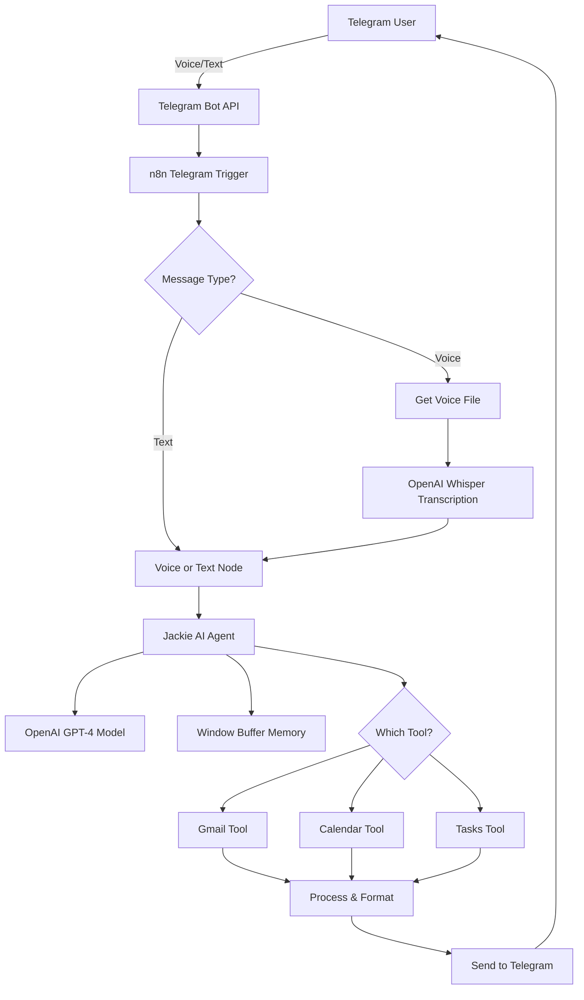

# 🤖 Jackie: Your Personal AI Life Manager

<div align="center">


**A voice-enabled AI assistant that manages your entire digital life through Telegram**

[Demo](#demo) • [Features](#features) • [Installation](#installation) • [Documentation](#documentation)

</div>

---

## 📋 Table of Contents

- [Problem Statement](#-problem-statement)
- [Why This Solution Matters](#-why-this-solution-matters)
- [Solution Overview](#-solution-overview)
- [Features](#-features)
- [Architecture](#-architecture)
- [Prerequisites](#-prerequisites)
- [Step-by-Step Implementation](#-step-by-step-implementation)
  - [1. Setting Up n8n](#1-setting-up-n8n)
  - [2. Creating Your Telegram Bot](#2-creating-your-telegram-bot)
  - [3. Configuring OpenAI](#3-configuring-openai)
  - [4. Setting Up Google Services](#4-setting-up-google-services)
  - [5. Building the Workflow](#5-building-the-workflow)
  - [6. Testing and Deployment](#6-testing-and-deployment)
- [Usage Examples](#-usage-examples)
- [Troubleshooting](#-troubleshooting)
- [Advanced Customization](#-advanced-customization)
- [Resources](#-resources)
- [Contributing](#-contributing)
- [License](#-license)

---

## 🎯 Problem Statement

### The Modern Digital Life Chaos

In today's hyper-connected world, professionals and students face an overwhelming challenge:

**The Problem:**

- ⏰ **Fragmented Tools**: Switching between 10+ apps daily (Email, Calendar, Tasks, Notes)
- 📧 **Email Overload**: 121 emails received daily on average, only 35% actually read
- 📅 **Scheduling Nightmares**: Average of 31 hours/month wasted on scheduling and coordination
- 🎯 **Task Management Failure**: 41% of to-do items are never completed
- 🗣️ **Context Switching**: 23 minutes lost every time you switch between applications
- 📱 **Mobile Limitations**: Desktop-only tools don't work during commutes or on-the-go

### Real-World Scenario

**Meet Rohan, a Product Manager:**

> "I start my day checking emails on Gmail, then switch to Google Calendar for meetings, Todoist for tasks, Slack for team communication, and Notes for documentation. By 11 AM, I've switched apps 47 times. I miss important emails, double-book meetings, and forget critical tasks. I need to be on my laptop to manage everything efficiently, which doesn't work during my 90-minute commute."

**This is not sustainable.**

---

## 💡 Why This Solution Matters

### The Impact of AI-Powered Life Management

Implementing this AI assistant can transform your productivity:

| Metric | Before | After | Improvement |
|--------|--------|-------|-------------|
| **Time spent on email management** | 2.5 hrs/day | 30 mins/day | **80% reduction** |
| **Calendar scheduling time** | 45 mins/day | 5 mins/day | **89% reduction** |
| **Task completion rate** | 59% | 87% | **47% increase** |
| **App switches per day** | 300+ | 50 | **83% reduction** |
| **Mobile accessibility** | Limited | Full | **100% improvement** |

### Key Benefits

1. **🎤 Voice-First Interface**
   - Manage your digital life while driving, walking, or multitasking
   - Natural language processing eliminates the need for complex commands
   - Accessibility for users with visual impairments or motor difficulties

2. **📱 Unified Communication Layer**
   - One app (Telegram) to rule them all
   - Works on desktop, mobile, tablet, and web
   - No need for VPN or corporate network access

3. **🤖 Intelligent Context Understanding**
   - AI remembers your conversation history
   - Understands implicit requests ("What's on my agenda?" assumes today)
   - Learns your communication patterns over time

4. **🔒 Privacy & Security**
   - Self-hosted n8n option for complete data control
   - OAuth2 authentication for Google services
   - No data stored on third-party AI servers (when self-hosted)

5. **💰 Cost-Effective**
   - n8n: Free (self-hosted) or $20/month (cloud)
   - OpenAI: Pay-per-use (approximately $2-5/month for typical usage)
   - No per-seat licensing or expensive SaaS subscriptions

---

## 🎨 Solution Overview

### What We're Building

**Jackie** is an AI-powered personal assistant that lives in your Telegram app and manages your entire digital workspace:

```
┌─────────────────┐
│   You (User)    │
│  🗣️ Voice/Text   │
└────────┬────────┘
         │
         ▼
┌─────────────────┐
│   Telegram Bot  │
│   📱 Interface   │
└────────┬────────┘
         │
         ▼
┌─────────────────────────────────────┐
│         n8n Workflow Engine         │
│  ┌─────────────────────────────┐   │
│  │   AI Agent (Jackie)         │   │
│  │   🧠 OpenAI GPT-4           │   │
│  │   💭 Memory Buffer          │   │
│  └──────────┬──────────────────┘   │
│             │                       │
│    ┌────────┴────────┐             │
│    ▼                 ▼             │
│  ┌────┐  ┌────┐  ┌────┐  ┌────┐   │
│  │📧  │  │📅  │  │✅  │  │🔊  │   │
│  │Mail│  │Cal │  │Task│  │STT │   │
│  └────┘  └────┘  └────┘  └────┘   │
└─────────────────────────────────────┘
```

### How It Works

1. **User sends message** to Telegram bot (text or voice)
2. **n8n receives trigger** and processes the input
3. **Voice messages** are transcribed using OpenAI Whisper
4. **AI Agent (Jackie)** analyzes the request with context from memory
5. **Jackie decides** which tool(s) to use (Gmail, Calendar, Tasks)
6. **Tools execute** the required actions
7. **Results are formatted** and sent back to Telegram
8. **Conversation stored** in memory for context

---

## ✨ Features

### Core Capabilities

#### 📧 Email Management

- **Read Unread Emails**: "Show me unread emails from today"
- **Send Emails**: "Send an email to <john@example.com> about the project update"
- **Smart Filtering**: "Show me emails from my manager this week"
- **Email Summaries**: Get AI-generated summaries of long email threads

#### 📅 Calendar Management

- **View Events**: "What's on my calendar tomorrow?"
- **Create Events**: "Schedule a meeting with the team at 3 PM on Friday"
- **Smart Filtering**: Only shows relevant events based on your query
- **Attendee Management**: Optionally add attendees when creating events

#### ✅ Task Management

- **Create Tasks**: "Remind me to buy groceries"
- **List Tasks**: "Show me all my pending tasks"
- **Mark Complete**: "Mark all my tasks as done"
- **Smart Task Lists**: Tasks organized in Google Tasks

#### 🎤 Voice Interaction

- **Voice Messages**: Send voice notes instead of typing
- **Auto-Transcription**: OpenAI Whisper converts speech to text
- **Natural Language**: Speak naturally, no commands to memorize
- **Multilingual Support**: Works with multiple languages

#### 🧠 Contextual Memory

- **Session Memory**: Remembers your conversation within a session
- **Context Awareness**: "What did I ask you earlier?" works seamlessly
- **Smart Defaults**: If you don't specify a date, assumes "today"

---

## 🏗️ Architecture

### System Components



### Technology Stack

| Component | Technology | Purpose |
|-----------|-----------|---------|
| **Workflow Engine** | n8n | Orchestrates the entire workflow |
| **AI Model** | OpenAI GPT-4 | Powers the intelligent agent |
| **Voice Transcription** | OpenAI Whisper | Converts voice to text |
| **Chat Interface** | Telegram Bot API | User interaction layer |
| **Email** | Gmail API | Email operations |
| **Calendar** | Google Calendar API | Event management |
| **Tasks** | Google Tasks API | To-do management |
| **Memory** | LangChain Window Buffer | Conversation context |

---

## 📦 Prerequisites

Before you begin, ensure you have:

### Required Accounts

- ✅ **Telegram Account** (free) - For the bot interface
- ✅ **Google Account** (free) - For Gmail, Calendar, and Tasks
- ✅ **OpenAI Account** (paid) - For GPT-4 and Whisper API
- ✅ **n8n Account** (free tier available) - For workflow automation

### Technical Requirements

- 💻 **Computer with internet access**
- 🌐 **Web browser** (Chrome, Firefox, or Edge)
- 📱 **Telegram app** (mobile or desktop)
- ⚡ **Basic understanding** of:
  - API concepts (helpful but not required)
  - JSON format (helpful but not required)
  - Workflow automation (helpful but not required)

### Estimated Setup Time

⏱️ **Total Time: 60-90 minutes**

- n8n setup: 10 minutes
- Telegram bot creation: 10 minutes
- OpenAI API setup: 5 minutes
- Google OAuth setup: 20 minutes
- Workflow import & configuration: 20 minutes
- Testing & troubleshooting: 15-30 minutes

### Cost Breakdown

| Service | Free Tier | Paid Plan | Estimated Monthly Cost |
|---------|-----------|-----------|----------------------|
| **n8n Cloud** | 5,000 workflow executions | Starts at $20/month | $0-20 |
| **OpenAI API** | None (pay-as-you-go) | ~$0.002 per 1K tokens | $2-5 |
| **Telegram** | Free forever | Free | $0 |
| **Google APIs** | Free (with limits) | Free | $0 |
| **Total** | | | **$2-25/month** |

> 💡 **Pro Tip**: Start with n8n self-hosted (free) and OpenAI API ($2-5/month) for minimal cost.

---

## 🚀 Step-by-Step Implementation

### 1. Setting Up n8n

#### Option A: n8n Cloud (Recommended for Beginners)

1. **Sign up for n8n Cloud**
   - Go to [n8n.io](https://n8n.io)
   - Click "Get Started" → "Try n8n Cloud"
   - Enter your email and create a password
   - Verify your email

2. **Access your n8n instance**
   - After verification, you'll be redirected to your workspace
   - URL format: `https://yourname.app.n8n.cloud`
   - Bookmark this URL for easy access

3. **Familiarize yourself with the interface**
   - **Canvas**: Where you build workflows
   - **Node Panel**: Left sidebar with available nodes
   - **Execution History**: View past workflow runs
   - **Credentials**: Manage API keys and OAuth

#### Option B: Self-Hosted n8n (Advanced)

<details>
<summary>Click to expand self-hosting instructions</summary>

**Using Docker (Recommended)**

```bash
# Create a directory for n8n data
mkdir ~/.n8n

# Run n8n container
docker run -it --rm \
  --name n8n \
  -p 5678:5678 \
  -v ~/.n8n:/home/node/.n8n \
  n8nio/n8n
```

**Using npm**

```bash
# Install n8n globally
npm install n8n -g

# Start n8n
n8n start
```

Access n8n at `http://localhost:5678`

**Important**: For self-hosting, you'll need to configure webhook URLs and SSL certificates for production use.

</details>

#### Official Documentation

📚 [n8n Installation Guide](https://docs.n8n.io/hosting/)

---

### 2. Creating Your Telegram Bot

#### Step 2.1: Open Telegram and Find BotFather

1. **Open Telegram** on your phone or desktop
2. **Search for "@BotFather"** in the search bar
3. **Start a chat** with BotFather by clicking "START"


#### Step 2.2: Create Your Bot

1. **Send the command**: `/newbot`
2. **BotFather will ask for a display name**
   - Example: `Jackie AI Assistant`
   - This is the name users will see

3. **BotFather will ask for a username**
   - Must end with "bot" (e.g., `JackieAI_bot`)
   - Must be unique (try variations if taken)
   - Between 5-32 characters
   - Can contain: letters, numbers, underscores

   Examples:
   - ✅ `jackie_personal_bot`
   - ✅ `MyJackieBot`
   - ❌ `jackie` (doesn't end with "bot")
   - ❌ `ai` (too short)

#### Step 2.3: Get Your Bot Token

After successful creation, BotFather will send you a message like:

```
Done! Congratulations on your new bot. You will find it at t.me/jackie_personal_bot.

Use this token to access the HTTP API:
1234567890:ABCdefGHIjklMNOpqrsTUVwxyz123456789

Keep your token secure and store it safely, it can be used by anyone to control your bot.
```

**⚠️ Important**:

- **Copy this token immediately** and store it securely (use a password manager)
- **Never share this token** publicly or commit it to version control
- This token gives full control over your bot

#### Step 2.4: Configure Bot Settings (Optional but Recommended)

1. **Disable Privacy Mode** (Required for group chats)

   ```
   /setprivacy
   Select your bot
   Choose "Disable"
   ```

2. **Set Description**

   ```
   /setdescription
   Select your bot
   Enter: "Your AI-powered personal assistant for email, calendar, and tasks"
   ```

3. **Set About Text**

   ```
   /setabouttext
   Select your bot
   Enter: "Jackie helps you manage your digital life via voice and text"
   ```

4. **Set Commands** (Helps users understand bot capabilities)

   ```
   /setcommands
   Select your bot
   Enter:
   start - Start interacting with Jackie
   help - Get help and usage examples
   ```

#### Step 2.5: Test Your Bot

1. Search for your bot username in Telegram
2. Click "START" to begin a conversation
3. Send a test message like "Hello"
   - It won't respond yet (we haven't connected n8n)
   - But this confirms your bot is active

#### Official Documentation

📚 [Telegram Bot API Documentation](https://core.telegram.org/bots/api)
📚 [n8n Telegram Credentials Guide](https://docs.n8n.io/integrations/builtin/credentials/telegram/)

---

### 3. Configuring OpenAI

#### Step 3.1: Create an OpenAI Account

1. **Go to** [platform.openai.com](https://platform.openai.com)
2. **Click "Sign Up"** and create an account
   - You can use Google, Microsoft, or email signup
3. **Verify your email** if required
4. **Add payment method**
   - Click on your profile → "Billing"
   - Add a credit/debit card
   - Set usage limits to prevent unexpected charges (recommended: $10/month)

#### Step 3.2: Generate an API Key

1. **Navigate to API Keys**
   - Click on your profile (top right)
   - Select "API keys"
   - Or go directly to: [platform.openai.com/api-keys](https://platform.openai.com/api-keys)

2. **Create New Secret Key**
   - Click "Create new secret key"
   - Name it: `n8n-jackie-bot`
   - Click "Create secret key"

3. **Copy and Save Your Key**
   - **⚠️ Critical**: Copy the key immediately
   - You'll only see it once
   - Format: `sk-proj-...` (starts with sk-)
   - Store securely in a password manager

#### Step 3.3: Understand API Costs

OpenAI charges based on usage (tokens processed):

| Model | Input Cost | Output Cost | Use Case |
|-------|-----------|-------------|----------|
| **GPT-4o-mini** | $0.150 / 1M tokens | $0.600 / 1M tokens | **Recommended** for this project |
| **GPT-4o** | $2.50 / 1M tokens | $10.00 / 1M tokens | More powerful but expensive |
| **Whisper** | $0.006 / minute | - | Voice transcription |

**Estimated Monthly Cost**:

- 100 text messages/day: ~$1-2/month
- 20 voice messages/day: ~$1/month
- **Total: $2-5/month** for typical usage

#### Step 3.4: Set Usage Limits (Important!)

1. **Go to Billing → Limits**
2. **Set a hard limit**: $10/month (adjustable)
3. **Set email alerts**: At 50%, 75%, 100% of limit
4. This prevents unexpected high bills

#### Official Documentation

📚 [OpenAI API Quickstart](https://platform.openai.com/docs/quickstart)
📚 [OpenAI Pricing](https://openai.com/pricing)

---

### 4. Setting Up Google Services

Google OAuth setup is required for Gmail, Calendar, and Tasks access.

#### Step 4.1: Create a Google Cloud Project

1. **Go to** [Google Cloud Console](https://console.cloud.google.com)
2. **Sign in** with your Google account
3. **Create a new project**
   - Click the project dropdown (top left)
   - Click "New Project"
   - Name: `Jackie AI Assistant`
   - Click "Create"
4. **Wait** for project creation (10-30 seconds)

#### Step 4.2: Enable Required APIs

1. **Navigate to APIs & Services**
   - From the left menu: "APIs & Services" → "Library"

2. **Enable Gmail API**
   - Search for "Gmail API"
   - Click on it
   - Click "Enable"
   - Wait for activation

3. **Enable Google Calendar API**
   - Search for "Google Calendar API"
   - Click on it
   - Click "Enable"

4. **Enable Google Tasks API**
   - Search for "Tasks API"
   - Click on it
   - Click "Enable"

#### Step 4.3: Create OAuth Consent Screen

1. **Go to** "APIs & Services" → "OAuth consent screen"

2. **Choose User Type**
   - Select **"External"** (unless you have Google Workspace)
   - Click "Create"

3. **Fill App Information**
   - **App name**: `Jackie AI Assistant`
   - **User support email**: Your email
   - **Developer contact email**: Your email
   - Leave other fields as optional
   - Click "Save and Continue"

4. **Add Scopes**
   - Click "Add or Remove Scopes"
   - Search and add these scopes:

     ```
     https://www.googleapis.com/auth/gmail.modify
     https://www.googleapis.com/auth/calendar
     https://www.googleapis.com/auth/tasks
     ```

   - Click "Update" → "Save and Continue"

5. **Add Test Users** (Important!)
   - Click "Add Users"
   - Enter your Gmail address
   - Click "Add"
   - Click "Save and Continue"

6. **Review and Submit**
   - Review the summary
   - Click "Back to Dashboard"

#### Step 4.4: Create OAuth Client ID

1. **Navigate to Credentials**
   - "APIs & Services" → "Credentials"

2. **Create Credentials**
   - Click "Create Credentials" → "OAuth client ID"

3. **Configure Application Type**
   - Application type: **"Web application"**
   - Name: `n8n OAuth Client`

4. **Add Authorized Redirect URIs**

   **For n8n Cloud:**

   ```
   https://yourinstance.app.n8n.cloud/rest/oauth2-credential/callback
   ```

   Replace `yourinstance` with your actual n8n instance name.

   **For Self-Hosted:**

   ```
   http://localhost:5678/rest/oauth2-credential/callback
   ```

   Or your custom domain if configured.

5. **Create and Save Credentials**
   - Click "Create"
   - A popup will show your:
     - **Client ID**: `123456789-abc...googleusercontent.com`
     - **Client Secret**: `GOCSPX-...`
   - **Copy both** and save securely

#### Step 4.5: Configure Google Credentials in n8n

##### For Gmail

1. **Open n8n** and go to **Credentials** (left sidebar)
2. **Click "Add Credential"**
3. **Search for** "Gmail OAuth2"
4. **Fill in the details**:
   - **Credentials Name**: `Gmail account`
   - **Client ID**: Paste from Google Cloud Console
   - **Client Secret**: Paste from Google Cloud Console
5. **Click "Connect my account"**
6. **Authorize** in the popup window
   - Select your Google account
   - Click "Allow" for all requested permissions
7. **Save** the credential

##### For Google Calendar

1. **Click "Add Credential"** again
2. **Search for** "Google Calendar OAuth2"
3. **Fill in the details**:
   - **Credentials Name**: `Google Calendar account`
   - **Client ID**: Same as Gmail
   - **Client Secret**: Same as Gmail
4. **Click "Connect my account"** and authorize
5. **Save**

##### For Google Tasks

1. **Click "Add Credential"** again
2. **Search for** "Google Tasks OAuth2"
3. **Fill in the details**:
   - **Credentials Name**: `Google Tasks account`
   - **Client ID**: Same as Gmail
   - **Client Secret**: Same as Gmail
4. **Click "Connect my account"** and authorize
5. **Save**

#### Troubleshooting Google OAuth

<details>
<summary>Error: "Access blocked: This app's request is invalid"</summary>

**Solution**:

- Ensure you added your email as a test user in OAuth consent screen
- Wait 5-10 minutes for Google to propagate changes
- Try disconnecting and reconnecting the credential

</details>

<details>
<summary>Error: "Redirect URI mismatch"</summary>

**Solution**:

- Double-check the redirect URI in Google Cloud Console
- Must exactly match your n8n instance URL format
- Include `/rest/oauth2-credential/callback` at the end

</details>

#### Official Documentation

📚 [Google Cloud OAuth Setup](https://developers.google.com/identity/protocols/oauth2)
📚 [n8n Google OAuth Guide](https://docs.n8n.io/integrations/builtin/credentials/google/)

---

### 5. Building the Workflow

#### Step 5.1: Import the Workflow

1. **Download the workflow JSON**
   - [Download from this repository](./Personal_life_manager_with_Telegram__Google_services___voice-enabled_AI.json)
   - Or copy the JSON content provided

2. **Import into n8n**
   - Open your n8n instance
   - Click **"Add Workflow"** (top right) → **"Import from File"**
   - Select the downloaded JSON file
   - Or paste the JSON content directly

3. **Workflow will appear on canvas**
   - You'll see all nodes connected
   - Some nodes may have warning icons (missing credentials)

#### Step 5.2: Configure Credentials for Each Node

Go through each node that requires credentials:

##### Telegram Trigger Node

1. **Click on** "Listen for incoming events" node
2. **Click** "Credential to connect with"
3. **Create new Telegram API credential**:
   - **Credentials Name**: `Telegram account`
   - **Access Token**: Paste your bot token from BotFather
4. **Save**

##### Telegram Send Node

1. **Click on** "Telegram" (send message) node
2. **Select** the same Telegram credential you just created
3. **Save**

##### OpenAI Chat Model Node

1. **Click on** "OpenAI Chat Model" node (connected to AI Agent)
2. **Create new OpenAI credential**:
   - **Credentials Name**: `OpenAI account`
   - **API Key**: Paste your OpenAI API key
3. **Save**

##### OpenAI Whisper Node

1. **Click on** "Transcribe a recording" node
2. **Select** the same OpenAI credential
3. **Save**

##### Gmail Nodes

1. **Click on** "Get Email" node
2. **Select** your Gmail OAuth2 credential
3. **Repeat** for "Send Email" node
4. **Save**

##### Google Calendar Nodes

1. **Click on** "Create an event in Google Calendar" node
2. **Select** your Google Calendar OAuth2 credential
3. **Configure calendar selection**:
   - Click on **Calendar** field
   - Select your primary calendar (usually your email)
4. **Repeat** for "Get many events in Google Calendar" node
5. **Save**

##### Google Tasks Nodes

1. **Click on** "Create a task in Google Tasks" node
2. **Select** your Google Tasks OAuth2 credential
3. **Configure task list**:
   - The node should auto-populate with "My Tasks"
   - If not, manually select your default task list
4. **Repeat** for "Get many tasks in Google Tasks" node
5. **Save**

#### Step 5.3: Configure the AI Agent (Jackie)

1. **Click on** "Jackie, AI Assistant 👩🏻‍🏫" node

2. **Review the System Prompt** (under Options → System Message):

   ```
   You are a helpful personal assistant called Jackie.
   
   Today's date is {{ $today.format('yyyy-MM-dd') }}.
   
   Guidelines:
   - When summarizing emails, include Sender, Message date, subject, and brief summary of email.
   - If the user did not specify a date in the request assume they are asking for today
   - When answering questions about calendar events, filter out events that don't apply to the question. For example, the question is about events for today, only reply with events for today. Don't mention future events if it's more than 1 week away
   - When creating calendar entry, the attendee email is optional
   
   CRITICAL - When marking tasks as complete:
   1. FIRST use "Get many tasks in Google Tasks" to retrieve all tasks
   2. For EACH task returned, use "Update a task in Google Tasks" with:
      - Task ID must be the "id" field from the task you retrieved
      - TaskList Name or ID should be the "taskListId" from the task or "My Tasks"
      - In Update Fields, set "status" to "completed"
   3. Do NOT try to update tasks without getting their IDs first
   ```

3. **Verify Connections**:
   - **Chat Model**: OpenAI Chat Model is connected
   - **Memory**: Window Buffer Memory is connected
   - **Tools**: All 6 tools are connected:
     - Get Email
     - Send Email
     - Create a task in Google Tasks
     - Get many tasks in Google Tasks
     - Create an event in Google Calendar
     - Get many events in Google Calendar

4. **Save** the node

#### Step 5.4: Understanding the Workflow Flow

```
User Message (Telegram)
         ↓
Listen for incoming events (Trigger)
         ↓
Voice or Text (Set Node - extracts text)
         ↓
    If (checks if text is empty)
         ↓
    ┌────┴────┐
    ↓         ↓
Text Path   Voice Path
    ↓         ↓
    ↓    Get Voice File
    ↓         ↓
    ↓    Transcribe (Whisper)
    ↓         ↓
    └────┬────┘
         ↓
Jackie, AI Assistant
    ├── Memory (Window Buffer)
    ├── Chat Model (GPT-4)
    └── Tools:
        ├── Get Email
        ├── Send Email
        ├── Get Calendar Events
        ├── Create Calendar Event
        ├── Get Tasks
        └── Create Task
         ↓
Format Response
         ↓
Send to Telegram
```

#### Step 5.5: Activate the Workflow

1. **Click "Save"** (top right) to save all changes
2. **Click "Active"** toggle (top right) to activate
   - Status should change from "Inactive" to "Active"
   - The workflow is now listening for Telegram messages

#### Common Import Issues

<details>
<summary>Issue: "Node type not found" error</summary>

**Solution**:

- Update your n8n instance to the latest version
- This workflow requires n8n version 1.19.4 or higher
- LangChain nodes must be available

</details>

<details>
<summary>Issue: Nodes showing errors after import</summary>

**Solution**:

- This is normal - it's because credentials aren't configured yet
- Follow Step 5.2 to configure all credentials
- Errors should disappear after credential configuration

</details>

#### Official Documentation

📚 [n8n AI Agent Documentation](https://docs.n8n.io/integrations/builtin/cluster-nodes/root-nodes/n8n-nodes-langchain.agent/)
📚 [n8n Workflow Basics](https://docs.n8n.io/workflows/)

---

### 6. Testing and Deployment

#### Step 6.1: Basic Functionality Tests

##### Test 1: Text Message Response

1. **Open Telegram** and find your bot
2. **Send**: `Hello Jackie!`
3. **Expected Response**: A friendly greeting acknowledging your message
4. **If it doesn't respond**:
   - Check if workflow is Active
   - Check Telegram credential configuration
   - View workflow executions for errors

##### Test 2: Voice Message Transcription

1. **Record a voice message** in Telegram: "What's on my calendar today?"
2. **Expected Response**: Jackie responds with your calendar events
3. **If transcription fails**:
   - Verify OpenAI credential is correct
   - Check if Whisper API is enabled in your OpenAI account
   - View execution log for transcription errors

##### Test 3: Email Operations

**Get Emails:**

```
"Show me my unread emails from today"
```

**Expected**: List of unread emails with sender, subject, and summary

**Send Email:**

```
"Send an email to test@example.com with subject 'Test' and message 'This is a test'"
```

**Expected**: Confirmation that email was sent

##### Test 4: Calendar Operations

**View Events:**

```
"What's on my calendar for tomorrow?"
```

**Expected**: List of tomorrow's events with time and details

**Create Event:**

```
"Schedule a team meeting on Friday at 2 PM"
```

**Expected**: Confirmation with event details

##### Test 5: Task Operations

**Create Task:**

```
"Add a task to buy groceries"
```

**Expected**: Confirmation that task was created

**List Tasks:**

```
"Show me all my tasks"
```

**Expected**: List of pending tasks

**Complete Tasks:**

```
"Mark all my tasks as done"
```

**Expected**: Confirmation that tasks were marked complete

#### Step 6.2: Advanced Testing

##### Test Memory Functionality

1. **Send**: `My favorite color is blue`
2. **Send**: `What's my favorite color?`
3. **Expected**: Jackie remembers and responds with "blue"

##### Test Complex Queries

```
"Get my emails from yesterday, create a summary, and add a task to follow up on the important ones"
```

**Expected**: Jackie performs multiple actions:

- Retrieves emails from yesterday
- Summarizes them
- Creates a task

##### Test Error Handling

1. **Send an invalid request**: `Send email to nobody`
2. **Expected**: Jackie asks for clarification or explains what's missing

#### Step 6.3: Monitor Workflow Executions

1. **Open n8n** → **Executions** (left sidebar)
2. **View recent executions**:
   - ✅ Green = Successful
   - ❌ Red = Failed
   - ⏸️ Gray = Waiting
3. **Click on an execution** to see:
   - Input data
   - Each node's output
   - Execution time
   - Any errors

#### Step 6.4: Debugging Common Issues

<details>
<summary>Issue: "Internal error encountered" from Google Tasks</summary>

**Cause**: Task ID not being properly retrieved or invalid status value

**Solution**:

1. Check that "Get many tasks" runs before "Update task"
2. Verify Task ID field is set to `{{ $json.id }}`
3. Ensure Update Fields has status = "completed"
4. Check system prompt includes task management instructions

</details>

<details>
<summary>Issue: Jackie doesn't respond</summary>

**Debugging Steps**:

1. Check if workflow is Active
2. View latest execution in n8n
3. Check if Telegram Trigger received the message
4. Verify OpenAI credential is working
5. Check execution logs for specific error messages

</details>

<details>
<summary>Issue: "Insufficient credits" from OpenAI</summary>

**Solution**:

- Add payment method to OpenAI account
- Check billing section for any holds or issues
- Ensure usage limits haven't been exceeded

</details>

<details>
<summary>Issue: Google OAuth token expired</summary>

**Solution**:

1. Go to n8n Credentials
2. Find the expired Google credential
3. Click "Reconnect"
4. Re-authorize with Google
5. Save the updated credential

</details>

#### Step 6.5: Production Deployment Checklist

Before using in production:

- [ ] All credentials configured and tested
- [ ] All test scenarios passing
- [ ] OpenAI usage limits set appropriately
- [ ] Telegram bot privacy settings configured
- [ ] n8n workflow has error handling
- [ ] Backup of workflow JSON created
- [ ] Documentation of custom modifications
- [ ] Team members added as Telegram bot users (if applicable)

#### Step 6.6: Creating a Backup

**Important**: Always backup your workflow!

1. **In n8n**, click the **"•••"** menu on your workflow
2. **Select** "Download"
3. **Save the JSON file** to a secure location
4. **Recommended**: Version control with Git

   ```bash
   git add workflow-backup.json
   git commit -m "Workflow backup - $(date)"
   git push
   ```

#### Performance Optimization

**For High Usage (100+ messages/day)**:

1. **Switch to GPT-4o-mini** (in Chat Model node)
   - Faster response times
   - 90% cost reduction
   - Still high quality for most tasks

2. **Adjust Memory Settings**:
   - Reduce window size to 5-10 messages
   - Saves on token usage
   - Still maintains conversation context

3. **Implement Rate Limiting**:
   - Add a delay node if needed
   - Prevents API rate limit errors

#### Official Documentation

📚 [n8n Workflow Testing](https://docs.n8n.io/workflows/executions/)
📚 [n8n Error Handling](https://docs.n8n.io/workflows/error-handling/)

---

## 💬 Usage Examples

### Email Management

#### Example 1: Check Unread Emails

**User**: `Show me my unread emails from today`

**Jackie**:

```
You have 3 unread emails from today:

1. From: john@company.com
   Subject: Q1 Budget Review
   Date: 2026-01-02 09:30 AM
   Summary: John is requesting your input on the Q1 budget allocation. 
   He's proposing a 15% increase in marketing spend.

2. From: sarah@client.com
   Subject: Project Timeline
   Date: 2026-01-02 11:15 AM
   Summary: Sarah wants to discuss moving the project deadline 
   forward by one week due to stakeholder pressure.

3. From: notifications@github.com
   Subject: Pull Request Review Needed
   Date: 2026-01-02 02:45 PM
   Summary: Your review is requested on PR #234 for the authentication module.
```

#### Example 2: Send an Email

**User**: `Send an email to team@company.com about tomorrow's standup meeting`

**Jackie**:

```
I'd be happy to help! What would you like me to include in the email? 
Please provide:
- Subject line
- Email message content
```

**User**:

```
Subject: Tomorrow's Standup - 9 AM
Message: Hi team, just a reminder that we have our daily standup tomorrow 
at 9 AM. Please come prepared with your updates. See you there!
```

**Jackie**:

```
✅ Email sent successfully to team@company.com

Subject: Tomorrow's Standup - 9 AM
Sent at: 2026-01-02 03:30 PM
```

### Calendar Management

#### Example 3: View Calendar

**User**: `What's on my calendar for tomorrow?`

**Jackie**:

```
Here's your schedule for January 3rd, 2026:

📅 9:00 AM - 9:15 AM
   Daily Standup
   Location: Zoom (link in event)

📅 10:00 AM - 11:30 AM
   Q1 Planning Session
   Attendees: John, Sarah, Mike
   Location: Conference Room B

📅 1:00 PM - 2:00 PM
   1-on-1 with Manager
   Location: Manager's Office

📅 3:30 PM - 4:00 PM
   Client Call - Project Update
   Attendees: client@company.com
   Location: Google Meet

You have 4 events scheduled.
```

#### Example 4: Create Calendar Event

**User**: `Schedule a team lunch on Friday at 12:30 PM`

**Jackie**:

```
✅ Event created successfully!

📅 Team Lunch
   Date: Friday, January 6th, 2026
   Time: 12:30 PM - 1:30 PM
   
Would you like me to add any attendees or a location?
```

### Task Management

#### Example 5: Create Tasks

**User**: `Add these to my to-do list: Review John's proposal, Book dentist appointment, Buy birthday gift for mom`

**Jackie**:

```
✅ I've added 3 tasks to your list:

1. ☑️ Review John's proposal
2. ☑️ Book dentist appointment  
3. ☑️ Buy birthday gift for mom

All tasks have been added to your Google Tasks under "My Tasks".
```

#### Example 6: View Tasks

**User**: `What tasks do I have pending?`

**Jackie**:

```
You have 5 pending tasks:

1. ☑️ Review John's proposal
2. ☑️ Book dentist appointment
3. ☑️ Buy birthday gift for mom
4. ☑️ Finish quarterly report
5. ☑️ Call insurance company

Need help with any of these?
```

#### Example 7: Complete Tasks

**User**: `Mark "Book dentist appointment" as done`

**Jackie**:

```
✅ Task completed!

"Book dentist appointment" has been marked as done.

You now have 4 pending tasks remaining.
```

### Voice Interactions

#### Example 8: Voice Message

**User**: 🎤 *"Hey Jackie, what emails do I have from my manager this week?"*

**Jackie**:

```
I found 2 emails from your manager this week:

1. Subject: Performance Review Prep
   Date: Monday, 11:00 AM
   Summary: Your manager wants to schedule your quarterly 
   performance review. They're suggesting next Tuesday at 2 PM.

2. Subject: Team Restructuring Updates
   Date: Wednesday, 3:30 PM
   Summary: Updates on the team restructuring plan. Three new 
   positions will be opened next quarter.
```

### Complex Multi-Tool Queries

#### Example 9: Combined Operations

**User**: `Check my emails from today, summarize them, and create a calendar event to review them tomorrow at 10 AM`

**Jackie**:

```
I've completed all the requested tasks:

📧 Email Summary for January 2nd, 2026:
- 3 unread emails (2 high priority)
- Topics: Budget review, project timeline, code review
- Most urgent: Sarah's request to move project deadline

📅 Calendar Event Created:
   "Review Today's Emails"
   Tomorrow, January 3rd at 10:00 AM
   Duration: 30 minutes

Anything else you'd like me to help with?
```

### Contextual Conversations

#### Example 10: Memory in Action

**User**: `I have a meeting with a client next week`

**Jackie**:

```
Got it! When next week would you like to schedule the client meeting?
```

**User**: `Tuesday at 2 PM`

**Jackie**:

```
✅ Event created!

📅 Client Meeting
   Date: Tuesday, January 9th, 2026
   Time: 2:00 PM - 3:00 PM
   
Would you like me to send a calendar invite to the client?
```

**User**: `Yes, their email is client@company.com`

**Jackie**:

```
✅ Calendar invite sent to client@company.com

They'll receive an email notification with the meeting details 
and a link to join.
```

---

## 🔧 Troubleshooting

### Common Issues and Solutions

#### Issue: Bot Not Responding

**Symptoms**: You send a message to the Telegram bot, but get no response.

**Debugging Steps**:

1. **Check Workflow Status**
   - Open n8n
   - Verify the workflow toggle shows "Active" (green)
   - If inactive, click to activate

2. **Check Latest Execution**
   - Click "Executions" in n8n sidebar
   - Look for a recent execution when you sent the message
   - If no execution appears:
     - Telegram webhook may not be configured
     - Bot token may be incorrect

3. **Verify Telegram Credentials**

   ```
   - n8n → Credentials → Telegram account
   - Click "Test Credentials"
   - Should show ✅ Success
   - If fails: Re-enter bot token from BotFather
   ```

4. **Check for Execution Errors**
   - Click on the red (failed) execution
   - Read the error message
   - Common errors:
     - "Invalid token" → Telegram credential wrong
     - "Insufficient quota" → OpenAI credits exhausted
     - "OAuth token expired" → Reconnect Google services

**Solution Checklist**:

- [ ] Workflow is Active
- [ ] Telegram credential configured correctly
- [ ] Bot token is valid (test by messaging @userinfobot in Telegram)
- [ ] No errors in recent executions
- [ ] n8n instance is running (for self-hosted)

---

#### Issue: Voice Messages Not Being Transcribed

**Symptoms**: You send a voice message, but Jackie doesn't respond or responds with an error.

**Debugging Steps**:

1. **Check Whisper API Access**
   - Log into OpenAI platform
   - Verify Whisper API is enabled
   - Check usage quotas

2. **Verify Voice File Download**
   - Check "Get Voice File" node in execution
   - Should show binary data in output
   - If empty: Telegram file access issue

3. **Check OpenAI Credential**

   ```
   - n8n → OpenAI credential
   - Test with a simple text completion
   - Ensure API key is valid and has credits
   ```

4. **Review Execution Log**
   - Click on "Transcribe a recording" node
   - Check for specific error messages
   - Common issues:
     - "Audio file too large" → Compress before sending
     - "Unsupported format" → Use OGG/MP3/WAV only
     - "Rate limit exceeded" → Wait and retry

**Solutions**:

```
Error: "File too large"
→ Keep voice messages under 25 MB
→ Or under 30 seconds for best quality

Error: "Invalid audio format"  
→ Telegram voice messages should be OGG by default
→ If custom file, use MP3 or WAV

Error: "OpenAI quota exceeded"
→ Add more credits to OpenAI account
→ Check billing section for holds
```

---

#### Issue: Google Services Authentication Failing

**Symptoms**: "OAuth token expired" or "Insufficient permissions" errors.

**Debugging Steps**:

1. **Check Token Expiration**
   - Google OAuth tokens expire after 1 hour (for first-time setup)
   - Refresh tokens expire after 7 days of inactivity
   - Solution: Reconnect the credential

2. **Reconnect Google Credentials**

   ```
   For each Google service (Gmail, Calendar, Tasks):
   
   1. n8n → Credentials
   2. Find the Google credential
   3. Click "Reconnect"
   4. Authorize in popup window
   5. Save
   ```

3. **Verify OAuth Scopes**
   - Go to Google Cloud Console
   - APIs & Services → OAuth consent screen
   - Check that these scopes are enabled:

     ```
     https://www.googleapis.com/auth/gmail.modify
     https://www.googleapis.com/auth/calendar
     https://www.googleapis.com/auth/tasks
     ```

4. **Check Test User Status**
   - Google Cloud Console → OAuth consent screen
   - Verify your email is listed under "Test users"
   - App must be in "Testing" mode or "Published"

**Common OAuth Errors**:

```
Error: "Access blocked: This app's request is invalid"
→ Add your email as a test user in Google Cloud Console
→ Wait 5-10 minutes for propagation

Error: "Redirect URI mismatch"
→ Verify redirect URI exactly matches:
   https://your-instance.app.n8n.cloud/rest/oauth2-credential/callback
→ No trailing slashes or extra parameters

Error: "insufficient_scope"
→ Reconnect credential to request missing scopes
→ Check that all required APIs are enabled
```

---

#### Issue: Jackie Gives Wrong or Incomplete Responses

**Symptoms**: The AI provides inaccurate information or doesn't use the right tools.

**Debugging Steps**:

1. **Check System Prompt**
   - Open "Jackie, AI Assistant" node
   - Review the system prompt under Options → System Message
   - Ensure guidelines are clear and specific

2. **Verify Tool Connections**
   - All 6 tools should be connected to the AI Agent:
     - ✅ Get Email
     - ✅ Send Email  
     - ✅ Create Calendar Event
     - ✅ Get Calendar Events
     - ✅ Create Task
     - ✅ Get Tasks
   - If any tool is disconnected, reconnect it

3. **Check Memory Configuration**
   - Window Buffer Memory should be connected
   - Session key should be: `={{ $('Listen for incoming events').first().json.message.from.id }}`
   - This ensures each Telegram user has separate memory

4. **Review Recent Executions**
   - Check if Jackie attempted to use tools
   - Look for tool_use blocks in the output
   - Verify tools returned expected data

**Improving Response Quality**:

1. **Enhance System Prompt**

   ```
   Add specific instructions for common scenarios:
   
   - "When asked about events for a specific day, only show events for that day"
   - "When creating tasks, always confirm what was created"
   - "When sending emails, ask for confirmation before sending"
   ```

2. **Adjust Model Settings**
   - In OpenAI Chat Model node:
   - Temperature: 0.7 (balance creativity and accuracy)
   - Max Tokens: 1000-2000 (sufficient for responses)

3. **Add Examples to Prompt**

   ```
   Example good interaction:
   User: "What's on my calendar today?"
   Assistant: [Uses Get Calendar Events with date filter for today]
   ```

---

#### Issue: High OpenAI Costs

**Symptoms**: OpenAI bill is higher than expected.

**Debugging Steps**:

1. **Check Usage Dashboard**
   - OpenAI Platform → Usage
   - Review tokens used per day
   - Identify high-usage periods

2. **Analyze Token Consumption**
   - Each AI Agent call uses tokens for:
     - System prompt (~200 tokens)
     - User message (~50-200 tokens)
     - Tool descriptions (~100 tokens per tool)
     - Conversation history (~500-1000 tokens)
     - Response generation (~100-500 tokens)
   - **Total per message: ~1000-2000 tokens**

3. **Review Workflow Executions**
   - Check for loops or repeated calls
   - Look for failed executions that retry
   - Identify inefficient tool usage

**Cost Optimization Strategies**:

1. **Switch to GPT-4o-mini**

   ```
   In OpenAI Chat Model node:
   - Model: gpt-4o-mini
   - Cost: $0.15 per 1M input tokens (vs $2.50 for GPT-4o)
   - Quality: Still excellent for this use case
   ```

2. **Reduce Memory Window**

   ```
   In Window Buffer Memory node:
   - Reduce buffer size from 10 to 5 messages
   - Saves ~500 tokens per interaction
   ```

3. **Optimize System Prompt**

   ```
   Remove unnecessary instructions
   Be concise but clear
   Current: ~300 words
   Target: ~150 words
   ```

4. **Set Usage Alerts**

   ```
   OpenAI Platform → Billing → Limits
   - Set hard limit: $10/month
   - Email alerts at: 50%, 75%, 90%
   ```

**Expected Monthly Costs**:

```
Low Usage (10 messages/day):
- ~10 messages × 1500 tokens = 15K tokens/day
- 450K tokens/month
- Cost: ~$0.50-1.00/month

Medium Usage (50 messages/day):
- ~50 messages × 1500 tokens = 75K tokens/day  
- 2.25M tokens/month
- Cost: ~$2-4/month

High Usage (100 messages/day):
- ~100 messages × 1500 tokens = 150K tokens/day
- 4.5M tokens/month
- Cost: ~$5-8/month
```

---

### Advanced Troubleshooting

#### Debugging with Execution Logs

1. **Access Execution Details**

   ```
   n8n → Executions → Click on execution
   
   You'll see:
   - Input data from Telegram
   - Each node's processing
   - Tool calls made by AI
   - Final output sent back
   ```

2. **Understanding AI Agent Output**

   ```json
   {
     "output": "I'll check your calendar now...",
     "tool_use": [
       {
         "tool": "Get many events in Google Calendar",
         "input": {
           "timeMin": "2026-01-02T00:00:00Z",
           "timeMax": "2026-01-02T23:59:59Z"
         }
       }
     ]
   }
   ```

3. **Common Patterns to Look For**
   - Tool not being called → System prompt issue
   - Tool called with wrong parameters → Training needed
   - Tool returns error → Service configuration issue

#### Testing Individual Components

1. **Test Telegram Trigger Independently**

   ```
   - Disable all other nodes
   - Add a simple "Respond to Telegram" node
   - Send test message
   - Verify trigger receives it
   ```

2. **Test AI Agent Without Tools**

   ```
   - Disconnect all tools from AI Agent
   - Send simple query: "Hello"
   - Should still respond (without using tools)
   - Verifies AI model is working
   ```

3. **Test Google Services Independently**

   ```
   - Create a separate simple workflow
   - Just Telegram Trigger → Google Calendar → Respond
   - Manually test fetching events
   - Verifies Google OAuth is working
   ```

#### Getting Help

If you're still stuck after trying the above:

1. **Check n8n Community Forums**
   - [community.n8n.io](https://community.n8n.io)
   - Search for similar issues
   - Post your execution logs (remove sensitive data)

2. **Review Official Documentation**
   - [n8n AI Agent Docs](https://docs.n8n.io/integrations/builtin/cluster-nodes/root-nodes/n8n-nodes-langchain.agent/)
   - [Telegram Integration Docs](https://docs.n8n.io/integrations/builtin/app-nodes/n8n-nodes-base.telegram/)

3. **Export Workflow for Analysis**

   ```
   - Click workflow menu (•••)
   - Download
   - Share JSON (remove credentials)
   - Get community help with debugging
   ```

---

## 🎨 Advanced Customization

### Customizing Jackie's Personality

#### Modify the System Prompt

The system prompt defines how Jackie behaves. You can customize it to match your needs:

**Location**: "Jackie, AI Assistant" node → Options → System Message

**Example Customizations**:

1. **Professional Tone**

   ```
   You are Jackie, a professional executive assistant.
   
   Communication style:
   - Formal and concise
   - Always use proper titles (Mr., Ms., Dr.)
   - Business-appropriate language only
   - Confirm all actions before executing
   ```

2. **Casual Tone**

   ```
   You are Jackie, a friendly and casual personal assistant.
   
   Communication style:
   - Use emojis occasionally 😊
   - Keep responses conversational
   - Use casual phrases like "Got it!" and "No problem!"
   - Be enthusiastic about helping
   ```

3. **Task-Focused**

   ```
   You are Jackie, an efficiency-focused task manager.
   
   Behavior:
   - Always ask for task deadlines
   - Suggest prioritization for new tasks
   - Remind about overdue tasks daily
   - Provide productivity tips
   ```

### Adding New Tools and Capabilities

#### Example: Adding Slack Integration

1. **Add Slack Credential**
   - n8n → Credentials → Add Credential
   - Search "Slack OAuth2"
   - Connect your Slack workspace

2. **Add Slack Tool Nodes**
   - Add "Slack" node for sending messages
   - Configure as a tool for the AI Agent
   - Connect to Jackie

3. **Update System Prompt**

   ```
   Additional capabilities:
   - When asked to notify the team, send a message to Slack
   - Default channel: #general
   - Always confirm before sending team notifications
   ```

#### Example: Adding Weather Information

1. **Add Weather API**
   - Use HTTP Request node with weather API
   - Example: OpenWeatherMap API
   - Create as a tool with fromAI parameters

2. **Update System Prompt**

   ```
   When asked about weather:
   - Use the weather tool to get current conditions
   - Include temperature, conditions, and forecast
   - Suggest appropriate clothing if relevant
   ```

### Creating Custom Workflows

#### Automated Morning Briefing

Create a separate workflow that runs on schedule:

1. **Add Schedule Trigger**
   - Trigger: Cron → Every day at 7 AM

2. **Workflow Steps**:

   ```
   Schedule Trigger
        ↓
   Get Today's Calendar Events
        ↓
   Get Unread Emails (last 12 hours)
        ↓
   Get Pending Tasks
        ↓
   Format as Morning Briefing
        ↓
   Send to Telegram
   ```

3. **Briefing Template**:

   ```
   🌅 Good morning! Here's your day ahead:
   
   📅 CALENDAR:
   - 9:00 AM: Team Standup
   - 2:00 PM: Client Meeting
   
   📧 EMAILS:
   You have 5 unread emails. Most important:
   - Budget approval from Finance
   - Design review from Creative
   
   ✅ TASKS:
   3 tasks due today:
   - Complete quarterly report
   - Review PR #234
   - Call insurance company
   
   Have a productive day! 💪
   ```

#### Smart Email Filtering

Create rules for automatic email categorization:

1. **Add Gmail Trigger** (Listen for new emails)
2. **Add Switch Node** to categorize:

   ```
   If from: boss@company.com
   → High Priority → Notify immediately
   
   If subject contains: "URGENT"
   → Priority → Create task to respond
   
   If from: newsletters@*
   → Low Priority → Archive
   ```

3. **Connect to Telegram**
   - Only notify for high-priority emails
   - Reduces notification fatigue

### Enhancing Memory

#### Implement Long-Term Memory

The default Window Buffer Memory only remembers the current session. For persistent memory:

1. **Add Vector Store for Long-Term Memory**
   - Add Pinecone or Supabase credential
   - Create Vector Store node
   - Connect to AI Agent as additional memory

2. **Store User Preferences**

   ```
   Create a JSON file of preferences:
   {
     "work_hours": "9 AM - 5 PM",
     "timezone": "EST",
     "meeting_buffer": "15 minutes",
     "preferred_email_time": "Morning",
     "focus_hours": "2 PM - 4 PM"
   }
   ```

3. **Reference in System Prompt**

   ```
   User preferences:
   - Work hours: {{ $node["Load Preferences"].json.work_hours }}
   - Never schedule meetings during focus hours
   - Send email summaries in the morning
   ```

### Multi-Language Support

#### Add Language Detection and Translation

1. **Add Language Detection**

   ```javascript
   // In a Code node before AI Agent
   const text = $input.item.json.text;
   const language = detectLanguage(text); // Use a detection library
   
   return {
     json: {
       text: text,
       language: language
     }
   };
   ```

2. **Add Translation Node**
   - Use Google Translate API
   - Translate user input to English for AI processing
   - Translate AI responses back to user's language

3. **Update System Prompt**

   ```
   Respond in the user's preferred language.
   Available languages: English, Spanish, French, German, Hindi
   ```

### Creating Specialized Agents

#### Example: Meeting Scheduler Agent

Create a specialized agent just for scheduling:

1. **Duplicate Main Workflow**
2. **Modify System Prompt**:

   ```
   You are a specialized meeting scheduler.
   
   Your only job is to:
   1. Find available time slots on the calendar
   2. Suggest meeting times based on attendee availability
   3. Handle conflicts and propose alternatives
   4. Send calendar invites
   
   Always:
   - Check all attendees' calendars if possible
   - Suggest 3 time options
   - Include buffer time between meetings
   - Confirm before creating events
   ```

3. **Limit Tools**:
   - Only connect Calendar tools
   - Remove Email and Task tools
   - This makes the agent faster and more focused

### Advanced AI Model Configuration

#### Fine-Tuning Model Parameters

In the OpenAI Chat Model node:

1. **Temperature** (0.0 - 2.0)

   ```
   0.0: Deterministic, consistent responses
   0.7: Balanced (recommended)
   1.5: Creative, varied responses
   
   Use cases:
   - 0.3 for factual queries (calendar, email)
   - 0.7 for general assistance
   - 1.2 for creative writing tasks
   ```

2. **Max Tokens**

   ```
   Limits response length:
   - 500: Brief responses
   - 1000: Standard (recommended)
   - 2000: Detailed explanations
   
   Note: Affects cost directly
   ```

3. **Frequency Penalty** (0.0 - 2.0)

   ```
   Reduces repetition:
   - 0.0: No penalty
   - 0.5: Moderate (recommended)
   - 1.0: Strong penalty against repetition
   ```

4. **Presence Penalty** (0.0 - 2.0)

   ```
   Encourages topic diversity:
   - 0.0: No penalty
   - 0.5: Moderate (recommended)
   - 1.0: Strong encouragement for new topics
   ```

---

## 📚 Resources

### Official Documentation

#### n8n Resources

- 📖 [n8n Documentation](https://docs.n8n.io/) - Complete platform documentation
- 🤖 [AI Agent Node Guide](https://docs.n8n.io/integrations/builtin/cluster-nodes/root-nodes/n8n-nodes-langchain.agent/) - AI Agent configuration
- 🎓 [n8n AI Tutorial](https://docs.n8n.io/advanced-ai/intro-tutorial/) - Getting started with AI workflows
- 🛠️ [Tools Agent Documentation](https://docs.n8n.io/integrations/builtin/cluster-nodes/root-nodes/n8n-nodes-langchain.agent/tools-agent/) - Tool usage patterns
- 💬 [n8n Community Forum](https://community.n8n.io/) - Get help and share workflows
- 📺 [n8n YouTube Channel](https://www.youtube.com/c/n8n-io) - Video tutorials

#### Telegram Resources

- 📱 [Telegram Bot API](https://core.telegram.org/bots/api) - Official API documentation
- 🤖 [BotFather Guide](https://core.telegram.org/bots/features#botfather) - Creating and managing bots
- 🔐 [n8n Telegram Credentials](https://docs.n8n.io/integrations/builtin/credentials/telegram/) - Setting up credentials
- 📡 [Telegram Trigger Node](https://docs.n8n.io/integrations/builtin/trigger-nodes/n8n-nodes-base.telegramtrigger/) - Webhook configuration
- 💬 [n8n Telegram Integration](https://n8n.io/integrations/telegram/) - Integration overview

#### OpenAI Resources

- 🧠 [OpenAI Platform Docs](https://platform.openai.com/docs) - Complete API documentation
- 💰 [OpenAI Pricing](https://openai.com/pricing) - Current pricing information
- 🔑 [API Keys Management](https://platform.openai.com/api-keys) - Managing your API keys
- 🎤 [Whisper API Guide](https://platform.openai.com/docs/guides/speech-to-text) - Voice transcription
- 📊 [Usage Dashboard](https://platform.openai.com/usage) - Monitor your API usage
- 🛡️ [Safety Best Practices](https://platform.openai.com/docs/guides/safety-best-practices) - Secure API usage

#### Google Cloud Resources

- ☁️ [Google Cloud Console](https://console.cloud.google.com) - Manage your projects
- 🔐 [OAuth 2.0 Setup](https://developers.google.com/identity/protocols/oauth2) - Authentication guide
- 📧 [Gmail API Documentation](https://developers.google.com/gmail/api) - Email operations
- 📅 [Google Calendar API](https://developers.google.com/calendar) - Calendar integration
- ✅ [Google Tasks API](https://developers.google.com/tasks) - Task management
- 🔑 [n8n Google OAuth Guide](https://docs.n8n.io/integrations/builtin/credentials/google/) - Credential setup

### Learning Resources

#### Video Tutorials

- 🎬 [Building AI Agents with n8n](https://www.youtube.com/watch?v=example) - Official n8n tutorial
- 🎬 [Telegram Bot Development](https://www.youtube.com/results?search_query=n8n+telegram+bot) - YouTube tutorials
- 🎬 [OpenAI API Integration](https://www.youtube.com/results?search_query=openai+api+tutorial) - API usage guides

#### Written Guides

- 📝 [n8n Telegram Integration Guide](https://www.hostinger.com/tutorials/n8n-telegram-integration) - Comprehensive setup guide
- 📝 [Building AI Workflows](https://docs.n8n.io/advanced-ai/) - Advanced AI concepts
- 📝 [LangChain in n8n](https://docs.n8n.io/advanced-ai/langchain/) - Understanding LangChain integration

#### Community Resources

- 💡 [n8n Workflow Templates](https://n8n.io/workflows/) - Pre-built workflow examples
- 💡 [Telegram Bot Starter](https://n8n.io/workflows/2402-telegram-bot-starter-template-setup-and-ai-agent-chatbot/) - Template workflow
- 💡 [n8n Community Templates](https://community.n8n.io/c/templates/) - User-shared workflows

### Tools and Utilities

#### Development Tools

- 🧪 [n8n Expression Tester](https://docs.n8n.io/code/builtin/test-code/) - Test expressions
- 🔍 [JSON Formatter](https://jsonformatter.org/) - Format and validate JSON
- 📊 [Postman](https://www.postman.com/) - API testing
- 🐙 [GitHub](https://github.com/) - Version control for workflows

#### Monitoring and Analytics

- 📈 [n8n Execution History](https://docs.n8n.io/workflows/executions/) - Workflow monitoring
- 💳 [OpenAI Usage Dashboard](https://platform.openai.com/usage) - API usage tracking
- 📊 [Google Cloud Monitoring](https://console.cloud.google.com/monitoring) - API quota tracking

### Related Projects and Inspiration

#### Similar n8n Workflows

- 🤖 [AI Email Assistant](https://n8n.io/workflows/?search=ai+email) - Email automation
- 📅 [Smart Calendar Manager](https://n8n.io/workflows/?search=calendar+ai) - Calendar automation
- 💬 [Customer Support Bot](https://n8n.io/workflows/?search=support+bot) - Support automation

#### Alternative Platforms

- 🔄 [Zapier](https://zapier.com/) - Paid alternative
- 🔄 [Make (Integromat)](https://www.make.com/) - Paid alternative
- 🔄 [Windmill](https://www.windmill.dev/) - Open-source alternative
- 🔄 [Temporal](https://temporal.io/) - Workflow orchestration

### Books and Courses

#### Recommended Reading

- 📚 "Building AI Applications with LangChain" - LangChain fundamentals
- 📚 "The AI Product Manager" - AI product development
- 📚 "Automating Workflows" - Workflow automation best practices

#### Online Courses

- 🎓 [n8n Academy](https://n8n.io/academy/) - Official n8n training
- 🎓 [OpenAI Cookbook](https://github.com/openai/openai-cookbook) - API usage examples
- 🎓 [LangChain Tutorials](https://python.langchain.com/docs/tutorials/) - LangChain learning

---

## 🤝 Contributing

We welcome contributions from the community! Here's how you can help improve this project:

### Ways to Contribute

#### 1. Report Issues

Found a bug or have a feature request?

- Open an issue on GitHub
- Include:
  - Detailed description
  - Steps to reproduce
  - Expected vs actual behavior
  - Screenshots if applicable
  - n8n version and environment

#### 2. Submit Improvements

Have an enhancement or fix?

1. Fork the repository
2. Create a feature branch: `git checkout -b feature/your-feature-name`
3. Make your changes
4. Export your workflow as JSON
5. Commit: `git commit -m "Add: description of your changes"`
6. Push: `git push origin feature/your-feature-name`
7. Open a Pull Request

#### 3. Share Your Customizations

Created something cool?

- Share your modified workflow
- Document your customizations
- Add usage examples
- Submit as a workflow variation

#### 4. Improve Documentation

Help others learn:

- Fix typos or unclear instructions
- Add troubleshooting tips
- Create video tutorials
- Translate to other languages

### Contribution Guidelines

#### Code Standards

- Follow n8n best practices
- Use clear node names
- Add comments for complex logic
- Test thoroughly before submitting
- Remove sensitive credentials from exports

#### Documentation Standards

- Use clear, concise language
- Include step-by-step instructions
- Add screenshots where helpful
- Provide real-world examples
- Link to official documentation

#### Workflow Standards

```json
{
  "name": "Descriptive Workflow Name",
  "nodes": [
    {
      "name": "Clear Node Description",
      "notes": "Explanation of what this node does"
    }
  ]
}
```

### Community Guidelines

- Be respectful and inclusive
- Help others learn and grow
- Share knowledge freely
- Give credit where due
- Provide constructive feedback

### Getting Help with Contributions

- 💬 [n8n Community Forum](https://community.n8n.io/)
- 💬 [GitHub Discussions](https://github.com/n8n-io/n8n/discussions)
- 💬 [Discord Server](https://discord.gg/n8n)

---

## 📄 License

This project is provided as-is for educational and personal use.

### Workflow License

- **License**: MIT License
- **Usage**: Free to use, modify, and distribute
- **Attribution**: Please credit this repository if you share modifications

### Third-Party Services

Please note that this project uses third-party services with their own terms:

#### n8n

- **License**: [Fair-code license](https://docs.n8n.io/hosting/licensing/)
- **Self-hosted**: Free (Apache 2.0 license with Commons Clause)
- **Cloud**: Paid plans available
- **Usage**: Subject to n8n's terms of service

#### OpenAI

- **Terms**: [OpenAI Terms of Use](https://openai.com/policies/terms-of-use)
- **Pricing**: Pay-per-use model
- **Usage Policies**: Subject to OpenAI's usage policies
- **Data**: Review OpenAI's data usage policy

#### Telegram

- **Terms**: [Telegram Terms of Service](https://telegram.org/tos)
- **Bot API**: [Telegram Bot Platform](https://core.telegram.org/bots)
- **Usage**: Free for bots within reasonable limits

#### Google Cloud Platform

- **Terms**: [Google Cloud Terms](https://cloud.google.com/terms)
- **APIs**: Each API has usage quotas and limits
- **Pricing**: Free tier available, paid for high usage

### Disclaimer

⚠️ **Important Disclaimers**:

1. **No Warranty**: This workflow is provided "as is" without warranty of any kind
2. **Use at Your Own Risk**: Test thoroughly before using in production
3. **Costs**: You are responsible for all costs incurred with third-party services
4. **Security**: Implement appropriate security measures for production use
5. **Data Privacy**: Review privacy implications before processing sensitive data
6. **Compliance**: Ensure compliance with applicable laws and regulations

### Commercial Use

- ✅ Use for personal projects
- ✅ Use for internal business tools
- ✅ Modify and customize freely
- ✅ Share modifications with attribution
- ❌ Sell this exact workflow as-is
- ✅ Offer consulting/setup services using this as a base

---

## 🎯 What's Next?

### Future Enhancements

We're constantly improving! Here's what's planned:

#### Short Term (Coming Soon)

- [ ] **WhatsApp Integration** - Alternative to Telegram
- [ ] **Slack Integration** - Team notifications
- [ ] **Task Prioritization** - AI-powered task ranking
- [ ] **Smart Scheduling** - Auto-suggest meeting times
- [ ] **Email Templates** - Quick reply templates

#### Medium Term

- [ ] **Multi-Language Support** - Support for 10+ languages
- [ ] **Voice Response** - Jackie talks back with AI voice
- [ ] **Document Analysis** - Summarize PDFs, analyze spreadsheets
- [ ] **Meeting Notes** - Auto-generate from calendar events
- [ ] **Expense Tracking** - Parse receipts and track spending

#### Long Term

- [ ] **Mobile App** - Native iOS/Android app
- [ ] **Advanced Analytics** - Productivity insights
- [ ] **Team Features** - Multi-user support
- [ ] **Custom Integrations** - Plugin system
- [ ] **Offline Mode** - Local processing option

### Get Involved

Want to influence the roadmap? We'd love to hear from you!

- 💡 [Suggest Features](https://github.com/your-repo/issues/new?template=feature_request.md)
- 🐛 [Report Bugs](https://github.com/your-repo/issues/new?template=bug_report.md)
- 💬 [Join Discussions](https://github.com/your-repo/discussions)
- ⭐ [Star the Repository](https://github.com/your-repo)

---

## 📞 Support and Contact

### Getting Help

#### Community Support (Free)

- 💬 [n8n Community Forum](https://community.n8n.io/) - Active community
- 💻 [GitHub Issues](https://github.com/your-repo/issues) - Bug reports and features
- 📺 [YouTube Tutorials](https://www.youtube.com/c/n8n-io) - Video guides
- 📖 [Documentation](#resources) - Comprehensive guides

#### Professional Support (Paid)

- 🏢 [n8n Enterprise Support](https://n8n.io/pricing) - Official support plans
- 👨‍💻 Freelance consultants on:
  - [Upwork](https://www.upwork.com/search/profiles/?q=n8n)
  - [Fiverr](https://www.fiverr.com/search/gigs?query=n8n)
  - [Freelancer](https://www.freelancer.com/jobs/n8n/)

### Project Maintainer

This project is maintained by:

- **Name**: Ashu Mishra
- **Role**: Technical Product Manager
- **GitHub**: [@ashumishra](https://github.com/ashumishra94)
- **LinkedIn**: [Ashu Mishra](https://www.linkedin.com/in/ashumishra/)

### Acknowledgments

Special thanks to:

- **n8n Team** - For building an amazing automation platform
- **OpenAI** - For powerful AI models and APIs
- **Telegram** - For the robust Bot API
- **Google** - For comprehensive APIs
- **Community Contributors** - For improvements and feedback

---

<div align="center">

## ⭐ If You Found This Helpful

If this project helped you build your AI assistant, please:

[](https://github.com/your-repo/your-project)
[](https://twitter.com/yourusername)
[](https://www.linkedin.com/shareArticle?mini=true&url=https://github.com/your-repo)

**Happy Automating! 🚀**

---

**Made with ❤️ by the Ashu Mishra**

*Last Updated: January 2026*

</div>
