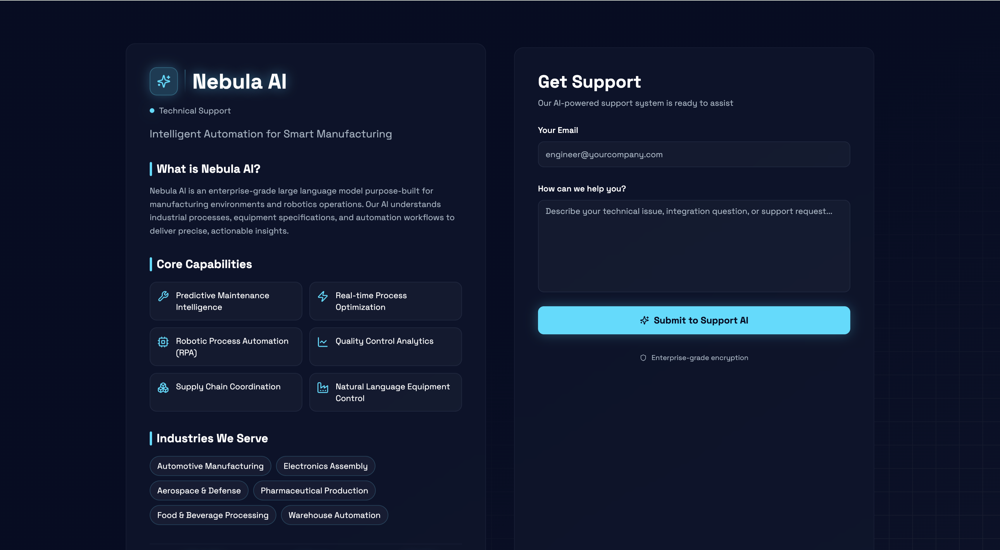
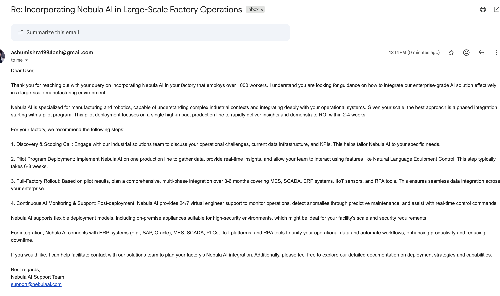
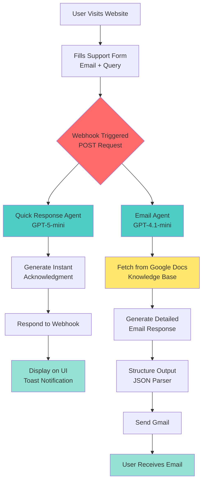

# Full Stack AI Agent Tutorial: Build Your Own AI-Powered Customer Support System

**Created by: Ashu Mishra**

## 📋 Table of Contents

- [Overview](#overview)
- [Problem Statement](#problem-statement)
- [Solution Architecture](#solution-architecture)
- [Prerequisites](#prerequisites)
- [System Flow Diagram](#system-flow-diagram)
- [Step-by-Step Implementation](#step-by-step-implementation)
  - [Part 1: Frontend Development with Lovable.dev](#part-1-frontend-development-with-lovabledev)
  - [Part 2: Backend Automation with n8n](#part-2-backend-automation-with-n8n)
- [Testing Your Application](#testing-your-application)
- [Troubleshooting](#troubleshooting)
- [Resources](#resources)

---

## 🎯 Overview

This tutorial teaches you how to build a complete **Full Stack AI Agent** for customer support using:

- **Frontend**: Lovable.dev (AI-powered UI generation)
- **Backend**: n8n (workflow automation platform)
- **AI Integration**: OpenAI GPT models for intelligent responses
- **Email**: Gmail integration for automated support

### What You'll Build


A professional AI-powered support interface for **Nebula AI** (a fictional enterprise LLM for manufacturing and robotics) that:

1. Provides instant responses on the website
2. Sends detailed email responses using AI and knowledge base
3. Uses RAG (Retrieval Augmented Generation) with Google Docs

---

## 🔴 Problem Statement

Modern businesses need efficient customer support systems that can:

- ✅ Respond to customer queries **instantly**
- ✅ Provide **accurate**, context-aware answers
- ✅ Scale **without hiring more support staff**
- ✅ Maintain **24/7 availability**
- ✅ Access and reference **company documentation** automatically

Traditional solutions are either:

- Too expensive (enterprise helpdesk software)
- Too manual (email-only support)
- Too limited (basic chatbots without knowledge base)

---

## 💡 Solution

Our Full Stack AI Agent solves these problems by:

### **Two-Tier Response System**

1. **Immediate Response**: Quick acknowledgment displayed on the website UI


1. **Detailed Response**: Comprehensive email sent after consulting knowledge base


### **Key Features**

- 🤖 **Dual AI Agents**: One for quick responses, one for detailed analysis
- 📚 **Knowledge Base Integration**: Connects to Google Docs for accurate information
- 📧 **Automated Email**: Sends professional, context-aware responses
- 🎨 **Futuristic UI**: Modern, responsive interface built with AI assistance
- 🔄 **Real-time Webhook**: Instant communication between frontend and backend

### **Technology Stack**

```
Frontend: Lovable.dev (React + Tailwind CSS)
    ↓
Webhook (POST request)
    ↓
n8n Workflow Automation
    ↓
OpenAI GPT Models (gpt-5-mini, gpt-4.1-mini)
    ↓
Google Docs (Knowledge Base)
    ↓
Gmail (Email Delivery)
```

---

## 📦 Prerequisites

### Required Accounts

1. **Lovable.dev** - [Sign up here](https://lovable.dev)
2. **n8n** - [Sign up here](https://n8n.io) (Cloud or self-hosted)
3. **OpenAI API** - [Get API key](https://platform.openai.com/api-keys)
4. **Google Account** - For Gmail and Google Docs
5. **GitHub** (optional) - For version control

### Required Skills

- Basic understanding of:
  - Web forms and webhooks
  - JSON format
  - AI prompting concepts
- No coding required! (AI generates the code)

---

## 📊 System Flow Diagram



### Flow Breakdown

#### **Path 1: Immediate UI Response** (Yellow Section)

1. User submits form → Webhook receives data
2. Quick Response Agent processes query
3. Generates 1-sentence acknowledgment
4. Returns to webhook → Displays on website
5. **Time: ~2-3 seconds**

#### **Path 2: Detailed Email** (Pink Section)

1. Simultaneously, Email Agent receives query
2. Searches Google Docs knowledge base
3. Extracts relevant information
4. Generates professional email with subject + body
5. Sends via Gmail
6. **Time: ~10-15 seconds**

---

## 🚀 Step-by-Step Implementation

### Part 1: Frontend Development with Lovable.dev

#### **Step 1: Login to Lovable.dev**

1. Go to [lovable.dev](https://lovable.dev)
2. Sign in with your account
3. Create a new project

---

#### **Step 2: Generate the UI**

Copy and paste this prompt into Lovable.dev:

<details>
<summary><b>Click to expand: Full UI Generation Prompt</b></summary>

```
Create a tech support interface for Nebula AI, an enterprise-grade LLM platform
specialized in manufacturing and robotics automation.

OVERALL LAYOUT:
Contained section design (not full-page)
Maximum width: 1200px, centered on page
Split into two panels with glass-morphism or card effect
Tech/futuristic aesthetic with subtle animations

LEFT PANEL (Information Section) - 45% width:
Header:
Logo: [WILL BE PROVIDED - placeholder for now]
Heading: "Nebula AI Technical Support"
Tagline: "Intelligent Automation for Smart Manufacturing"

Content Sections:
1. "What is Nebula AI?" Brief paragraph: "Nebula AI is an enterprise-grade large
language model purpose-built for manufacturing environments and robotics
operations. Our AI understands industrial processes, equipment
specifications, and automation workflows to deliver precise, actionable
insights."

2. "Core Capabilities" (with futuristic icons):
• Predictive Maintenance Intelligence
• Real-time Process Optimization
• Robotic Process Automation (RPA)
• Quality Control Analytics
• Supply Chain Coordination
• Natural Language Equipment Control

3. "Industries We Serve":
• Automotive Manufacturing
• Electronics Assembly
• Aerospace & Defense
• Pharmaceutical Production
• Food & Beverage Processing
• Warehouse Automation

4. Support Stats (displayed as glowing metrics):
"99.9% Uptime"
"<3 min Response Time"
"24/7 AI Support"

RIGHT PANEL (Support Form) - 55% width:
Form Header:
Title: "Get Support"
Subtitle: "Our AI-powered support system is ready to assist"

Form Fields (minimal, clean):
1. Email Address
   Label: "Your Email"
   Type: email input
   Placeholder: "engineer@yourcompany.com"
   Required: Yes
   Full width

2. Support Query
   Label: "How can we help you?"
   Type: textarea
   Rows: 6-7
   Placeholder: "Describe your technical issue, integration question, or
support request..."
   Required: Yes
   Full width

Submit Button:
Text: "Submit to Support AI"
Style: Prominent, futuristic button with glow effect
States:
• Default: Animated gradient or glow
• Hover: Intensified glow
• Loading: Pulsing animation with text "Sending to AI Support..."
• Success: Checkmark icon with "Message Sent Successfully!"

WEBHOOK RESPONSE NOTIFICATION:
After successful webhook submission, display a notification/popup with the AI-generated response:
Style: Futuristic toast notification or modal popup
Position: Top-right corner (toast) OR center overlay (modal)
Design: Glass-morphism card with glow border
Icon: AI robot icon or checkmark with cyan/blue glow
Content: Display the exact response text received from webhook
Auto-dismiss: After 8-10 seconds with smooth fade-out
Close button: Manual close option (X button in top-right)
Animation: Slide-in from right (toast) OR fade-in with scale (modal)
Background overlay (if modal): Semi-transparent dark backdrop with blur

The notification should feel like an AI assistant is responding - make it visually
distinct from generic success messages.

DESIGN SYSTEM - Tech/Futuristic Theme:
Color Palette:
• Background: Dark theme (#0A0E27 or similar deep navy/black)
• Panels: Semi-transparent cards with backdrop blur (glass-morphism)
• Primary Accent: Electric blue (#00F0FF or cyan-blue)
• Secondary Accent: Purple (#8B5CF6) or magenta
• Text Primary: White (#FFFFFF)
• Text Secondary: Light gray (#CBD5E1)
• Borders: Subtle glowing lines (#3B82F6 with opacity)
• Success/Notification: Cyan-blue (#00F0FF) with glow
• Error: Red (#EF4444) with glow

Visual Effects:
• Subtle grid pattern or circuit board texture in background
• Gradient overlays on panels
• Soft glow effects on interactive elements
• Smooth transitions (200-300ms)
• Hover effects with scale or glow intensification
• Floating animation on info cards (optional, subtle)

Typography:
• Headings: "Orbitron", "Exo 2", or "Rajdhani" (futuristic tech fonts)
• Body: "Inter", "Space Grotesk", or "Plus Jakarta Sans" (clean, readable)
• Sizes: Scale from 14px (body) to 32px (main heading)
• Font weights: Regular (400), Medium (500), Bold (700)

RESPONSIVE BEHAVIOR:
• Desktop (>1024px): Side-by-side panels (45% / 55%)
• Tablet (768-1024px): Side-by-side with adjusted spacing
• Mobile (<768px):
  - Stacked layout (info on top, form below)
  - Full width panels
  - Reduced padding
  - Slightly smaller typography
  - Notification adjusts to smaller screen (full-width on mobile)

TECHNICAL IMPLEMENTATION:
Framework: React with Tailwind CSS

WEBHOOK CONFIGURATION:
Add a configuration section at the top of your component:

// WEBHOOK CONFIGURATION
const WEBHOOK_CONFIG = {
  url: 'YOUR_N8N_WEBHOOK_URL_HERE', // <-- PLACEHOLDER
  method: 'POST',
  headers: {
    'Content-Type': 'application/json',
  }
};

Form Handling with Webhook Response Display:

const handleSubmit = async (e) => {
  e.preventDefault();
  
  const formData = {
    email: e.target.email.value,
    query: e.target.query.value,
    timestamp: new Date().toISOString(),
    source: 'Nebula AI Support Form'
  };
  
  setIsLoading(true);
  
  try {
    const response = await fetch(WEBHOOK_CONFIG.url, {
      method: WEBHOOK_CONFIG.method,
      headers: WEBHOOK_CONFIG.headers,
      body: JSON.stringify(formData)
    });
    
    if (response.ok) {
      const webhookResponse = await response.json();
      const aiMessage = webhookResponse.message || webhookResponse.response ||
        webhookResponse.data || 'Your query has been received!';
      
      setIsLoading(false);
      setNotificationMessage(aiMessage);
      setNotificationError(false);
      setShowNotification(true);
      
      e.target.reset();
      
      setTimeout(() => setShowNotification(false), 8000);
    }
  } catch (error) {
    console.error('Submission error:', error);
    setIsLoading(false);
    setNotificationError(true);
    setNotificationMessage('Unable to submit. Please try again.');
    setShowNotification(true);
    setTimeout(() => setShowNotification(false), 6000);
  }
};

Make it feel like a cutting-edge AI interface - think Iron Man's Jarvis or 
Blade Runner 2049, but professional and enterprise-appropriate.
```

</details>

**What This Creates:**

- A sleek, dark-themed support interface
- Left panel with company information
- Right panel with support form
- Futuristic design with glowing effects
- Responsive layout for all devices

---

#### **Step 3: Setup n8n Webhook**

1. **Login to n8n.io**
   - Go to [n8n.io](https://n8n.io)
   - Sign in or create account
   - Create new workflow

2. **Add Webhook Node**
   - Search for "Webhook" in the node panel
   - Drag it to the canvas
   - Click on the webhook node

3. **Configure Webhook**
   - **HTTP Method**: Change to `POST`
   - **Path**: Leave as auto-generated (or customize)
   - **Response Mode**: Select "Using Respond to Webhook Node"
   - Copy the webhook URL (looks like: `https://your-n8n-instance.app.n8n.cloud/webhook/...`)

![Webhook Configuration Screenshot - See PDF page 12]

---

#### **Step 4: Integrate Webhook with Lovable**

Go back to Lovable.dev and paste this prompt:

```
Please use the following webhook for integration and response:
{YOUR_WEBHOOK_URL_FROM_N8N}
```

**Replace `{YOUR_WEBHOOK_URL_FROM_N8N}` with your actual webhook URL!**

Lovable will automatically update the code to connect to your n8n webhook.

---

### Part 2: Backend Automation with n8n

Now we'll build the two parallel workflows shown in the diagram.

---

#### **WORKFLOW 1: Immediate Response to UI** (Yellow Box)

##### **Step 5: Add Quick Response Agent**

1. **Add AI Agent Node**
   - Search for "AI Agent" in n8n
   - Connect it to the Webhook node
   - Name it: `Quick response agent`

2. **Configure Chat Model**
   - Add "OpenAI Chat Model" node
   - Connect to the agent
   - **Model**: Select `gpt-5-mini`
   - **Credentials**: Add your OpenAI API key

3. **Set User Prompt**

   ```
   Email : {{ $json.body.email }}
   Query : {{ $json.body.query }}
   ```

##### **Step 6: Configure System Message**

In the agent options, add this **System Message**:

<details>
<summary><b>Click to expand: Quick Response System Prompt</b></summary>

```
You are a customer support agent for Nebula AI, an enterprise-grade large
language model purpose-built for manufacturing environments and robotics
operations. Nebula AI specializes in understanding industrial processes,
equipment specifications, and automation workflows to deliver precise,
actionable insights.

CONTEXT:
You will receive support queries from users via a web form. Each query will include:
- User's email address
- Their support query/message

YOUR TASK:
Generate an immediate, single-sentence response that will be sent back to the
webhook to display on the website interface.

RESPONSE REQUIREMENTS:
1. Keep it to ONE concise sentence (maximum 25 words)
2. Acknowledge receipt of their query
3. Inform them that a detailed response will be sent via email
4. Encourage them to check out the latest press release while waiting
5. Maintain a professional yet friendly tone
6. Use clear, simple language

RESPONSE FORMAT:
Your response should follow this structure:
"Thank you for contacting Nebula AI! Your query has been received and our team
will respond via email shortly. Meanwhile, check out our latest press release for
updates on manufacturing AI innovations."

TONE GUIDELINES:
- Professional and reassuring
- Efficient and clear
- Slightly futuristic (matching the tech brand)
- Avoid jargon
- No exclamation marks overuse (max 1-2)

EXAMPLES:

Input: User asks about integration issues
Output: "Your integration query has been received! Our support team will email
you a detailed solution shortly—meanwhile, explore our latest manufacturing
automation press release."

Input: User asks about pricing
Output: "Thank you for your interest in Nebula AI! Your pricing inquiry has been
logged and our team will respond via email within the hour. Check out our latest
press release while you wait."

Input: User reports a bug
Output: "Your bug report has been received and forwarded to our technical team.
You'll receive an email update soon—in the meantime, see what's new in our
latest press release!"

IMPORTANT CONSTRAINTS:
- DO NOT attempt to answer the technical query in this immediate response
- DO NOT make specific promises about response time beyond "shortly"
```

</details>

##### **Step 7: Add Respond to Webhook Node**

1. Add "Respond to Webhook" node
2. Connect it to the Quick Response Agent
3. No configuration needed - it automatically sends the agent's output

##### **Step 8: Add No Operation Node**

1. Add "No Operation, do nothing" node
2. Connect to Respond to Webhook
3. This cleanly ends this workflow branch

**✅ Checkpoint**: Your UI response workflow is complete!

---

#### **WORKFLOW 2: Send Email to Lead** (Pink Box)

##### **Step 9: Setup Knowledge Base (Google Docs)**

1. **Create Google Doc Copy**
   - Go to [Nebula AI FAQ Document](https://docs.google.com/document/d/1-3KdHUUDvIq5gmIa86J2RjtiRUKdHR_PS6Yc9dUfU_Q/edit)
   - Click "File" → "Make a copy"
   - Save to YOUR Google Drive
   - Copy the document URL

2. **What's in the Knowledge Base?**
   - Company information
   - Product features and capabilities
   - Technical specifications
   - Common troubleshooting steps
   - Integration guides
   - Pricing information

---

##### **Step 10: Add Email Agent**

1. **Add Second AI Agent**
   - Add another "AI Agent" node
   - Connect it to the Webhook (parallel to Quick Response)
   - Name it: `Email agent`

2. **Configure Chat Model**
   - Add "OpenAI Chat Model" node
   - **Model**: Select `gpt-4.1-mini` (more powerful for detailed responses)
   - Connect to Email agent
   - **Credentials**: Use same OpenAI API key

3. **Set User Prompt**

   ```
   {{ $json.body.query }}
   ```

   *(Just the query - email will be referenced from webhook)*

---

##### **Step 11: Configure Email Agent System Message**

<details>
<summary><b>Click to expand: Email Agent System Prompt</b></summary>

```
You are a technical support specialist for Nebula AI, an enterprise-grade LLM for
manufacturing and robotics. You will receive support queries and must provide
detailed, accurate responses by fetching information from our knowledge base
documentation.

WORKFLOW:
1. Receive user query and email address
2. Use Google Docs tool to fetch relevant information from our knowledge base
3. Analyze and condense the information
4. Generate a professional email response

INPUT DATA:
- User Query: {{query}}

YOUR TASK:
Generate a complete, professional email response that addresses the user's
query using information from the Google Docs knowledge base. The tool is
attached and called "Nebula FAQ". Please use this tool for all information -
using it is MANDATORY before answering.

GOOGLE DOCS TOOL USAGE:
- Access the Nebula AI knowledge base document
- Search for sections relevant to the user's query
- Extract key information, technical details, and solutions
- Synthesize information from multiple sections if needed

EMAIL RESPONSE REQUIREMENTS:
1. Subject Line: Create appropriate subject (format: "Re: [Brief topic from query]")
2. Greeting: Professional greeting
3. Query Acknowledgment: Brief recap of their question
4. Solution/Answer: Detailed response based on Google Docs content
   - Use information from the knowledge base
   - Be specific and actionable
   - Include step-by-step instructions if applicable
   - Cite relevant sections or features
5. Additional Resources: Suggest related documentation if relevant
6. Closing: Professional sign-off with support contact info

TONE & STYLE:
- Professional yet approachable
- Technical but clear (avoid excessive jargon)
- Confident and helpful
- Enterprise-appropriate

OUTPUT FORMAT:
Return a JSON object with this structure:
{
  "subject": "Email subject line",
  "body": "Full email body content",
  "relevant_docs": "Brief note of which sections were used (for internal logging)"
}

CONSTRAINTS:
- Keep email body between 200-400 words
- If information is not found in Google Docs, politely inform the user and offer to escalate
- Always maintain professional tone
- Include specific details from knowledge base (not generic responses)
- If query is outside Nebula AI scope, politely redirect

EXAMPLE OUTPUT STRUCTURE:
{
  "subject": "Re: Integration Setup for Manufacturing Systems",
  "body": "Dear Customer,\n\nThank you for contacting Nebula AI support regarding integration setup...\n\n[Detailed response based on docs]\n\nBest regards,\nNebula AI Support Team",
  "relevant_docs": "Integration Guide - Section 3.2"
}
```

</details>

---

##### **Step 12: Add Google Docs Tool**

1. **Add Google Docs Node**
   - Search for "Google Docs Tool"
   - Connect to Email Agent (as a tool)
   - Name it: `Nebula FAQ`

2. **Configure Google Docs**
   - **Operation**: Get Document
   - **Document URL**: Paste your Google Docs URL from Step 9
   - **Credentials**: Connect your Google account
   - Click "Test node" to verify connection

![Google Docs Configuration - See PDF page 23]

---

##### **Step 13: Add Structured Output Parser**

1. **Add Output Parser Node**
   - Search for "Structured Output Parser"
   - Connect to Email Agent
   - This ensures consistent JSON output

2. **Configure JSON Schema**
   Paste this example:

   ```json
   {
     "subject": "Re: Integration Setup for Manufacturing Systems",
     "body": "Dear Customer,\n\nThank you for contacting Nebula AI support regarding integration setup...\n\n[Detailed response based on docs]\n\nBest regards,\nNebula AI Support Team",
     "relevant_docs": "Integration Guide - Section 3.2"
   }
   ```

---

##### **Step 14: Add Gmail Node**

1. **Add Gmail Node**
   - Search for "Gmail"
   - Connect to Email Agent output
   - Name it: `Send a message`

2. **Configure Gmail**

   ```
   To: {{ $('Webhook').item.json.body.email }}
   Subject: {{ $json.output.subject }}
   Email Type: Text
   Message: {{ $json.output.body }}
   ```

3. **Options**
   - Uncheck "Append Attribution" (removes "Sent via n8n" footer)

4. **Credentials**
   - Connect your Gmail account
   - Authorize n8n access

![Gmail Configuration - See PDF page 24-25]

---

#### **Step 15: Activate and Test!**

1. **Save Your Workflow**
   - Click "Save" in top-right
   - Name it: "Nebula AI Support System"

2. **Activate the Workflow**
   - Toggle the "Active" switch to ON
   - Webhook is now live!

3. **Test the Complete Flow**
   - Go to your Lovable.dev preview
   - Fill out the support form
   - Submit and watch for:
     - ✅ Instant notification on UI
     - ✅ Email arrives in inbox within 10-15 seconds

---

## 🧪 Testing Your Application

### Test Cases

#### Test 1: General Product Inquiry

**Input:**

```
Email: test@example.com
Query: What is Nebula AI and how does it work?
```

**Expected:**

- UI shows acknowledgment within 3 seconds
- Email received with detailed explanation from knowledge base

---

#### Test 2: Technical Integration Question

**Input:**

```
Email: engineer@company.com
Query: How do I integrate Nebula AI with our SCADA system?
```

**Expected:**

- UI acknowledgment
- Email with step-by-step integration guide from docs

---

#### Test 3: Pricing Inquiry

**Input:**

```
Email: buyer@enterprise.com
Query: What are your pricing plans?
```

**Expected:**

- UI acknowledgment
- Email with pricing information from knowledge base

---

### Debugging Tips

**Problem**: Webhook returns error

- ✅ Check n8n workflow is Active
- ✅ Verify webhook URL is correct in Lovable
- ✅ Test webhook with manual execution in n8n

**Problem**: No email received

- ✅ Check Gmail credentials are authorized
- ✅ Verify email address in test form
- ✅ Check spam folder
- ✅ Review n8n execution log for errors

**Problem**: AI response is generic

- ✅ Ensure Google Docs tool is connected
- ✅ Verify knowledge base document is accessible
- ✅ Check system prompt includes "use the tool"

---

## 🛠️ Troubleshooting

### Common Issues

| Issue | Solution |
|-------|----------|
| 403 Error on Webhook | Workflow not activated - toggle Active switch |
| OpenAI API Error | Check API key validity and billing account |
| Google Docs not found | Verify document sharing settings (Anyone with link can view) |
| Email not sending | Re-authorize Gmail credentials in n8n |
| UI not updating | Clear browser cache, check webhook URL |

---

## 📚 Resources

### Official Documentation

- [n8n Documentation](https://docs.n8n.io/)
- [Lovable.dev Guide](https://lovable.dev/docs)
- [OpenAI API Reference](https://platform.openai.com/docs)

### Project Files

- **n8n Workflow JSON**: [Download from Google Drive](https://drive.google.com/file/d/1G4yw0gS3YJGbH62gDOJKrP7nwPf0BHJs/view?usp=sharing)
- **Knowledge Base Template**: [Nebula AI FAQ Doc](https://docs.google.com/document/d/1-3KdHUUDvIq5gmIa86J2RjtiRUKdHR_PS6Yc9dUfU_Q/edit?tab=t.0#heading=h.nqdcfodcuvk6)
- **GitHub Repository**: [Your repo link here]

### Live Demo

- **Application URL**: [Nebula AI Support Assistant](https://nebula-assist-forge.lovable.app/)

---

## 🎓 Learning Outcomes

After completing this tutorial, you will understand:

- ✅ How to build AI-powered web applications without traditional coding
- ✅ Webhook integration between frontend and backend
- ✅ Multi-agent AI systems with specialized roles
- ✅ RAG (Retrieval Augmented Generation) implementation
- ✅ Workflow automation with n8n
- ✅ Structured output parsing for reliable AI responses
- ✅ Email automation with AI-generated content

---

## 🚀 Next Steps & Enhancements

### Beginner Enhancements

1. **Customize the UI**: Change colors, logos, company information
2. **Expand Knowledge Base**: Add more FAQs to Google Docs
3. **Add More Test Cases**: Try different types of queries

### Intermediate Enhancements

1. **Multi-language Support**: Add translation AI agent
2. **Sentiment Analysis**: Route urgent/angry queries to human support
3. **Follow-up Emails**: Add drip campaign for unanswered queries
4. **Analytics Dashboard**: Track query types and response times

### Advanced Enhancements

1. **Vector Database**: Replace Google Docs with Pinecone/Weaviate
2. **Voice Support**: Add Whisper API for audio query transcription
3. **CRM Integration**: Connect to Salesforce/HubSpot
4. **A/B Testing**: Test different AI models and prompts
5. **Conversation Memory**: Store chat history in database

---

## 📝 Implementation Checklist

Use this checklist to track your progress:

### Frontend Setup

- [ ] Create Lovable.dev account
- [ ] Generate UI with provided prompt
- [ ] Test UI responsiveness on mobile/tablet/desktop
- [ ] Verify form validation works

### Backend Setup - Part 1 (Quick Response)

- [ ] Create n8n account and workflow
- [ ] Add Webhook node (POST method)
- [ ] Configure Quick Response Agent
- [ ] Add OpenAI credentials (gpt-5-mini)
- [ ] Add system prompt for quick responses
- [ ] Add Respond to Webhook node
- [ ] Test immediate response flow

### Backend Setup - Part 2 (Email)

- [ ] Copy Nebula FAQ Google Doc to your drive
- [ ] Add Email Agent node
- [ ] Configure OpenAI credentials (gpt-4.1-mini)
- [ ] Add system prompt for email agent
- [ ] Connect Google Docs tool
- [ ] Test Google Docs access
- [ ] Add Structured Output Parser
- [ ] Configure Gmail node
- [ ] Authorize Gmail access
- [ ] Test email delivery

### Integration & Testing

- [ ] Copy webhook URL from n8n
- [ ] Update Lovable with webhook URL
- [ ] Activate n8n workflow
- [ ] Test complete flow end-to-end
- [ ] Verify UI notification appears
- [ ] Verify email is received
- [ ] Test with multiple query types
- [ ] Check response quality

### Deployment & Documentation

- [ ] Deploy Lovable app (if available)
- [ ] Document your webhook URL
- [ ] Export n8n workflow as backup
- [ ] Create GitHub repository (optional)
- [ ] Add README with your customizations
- [ ] Share with community!

---

## 🤝 Contributing

Have improvements or found bugs? Contributions are welcome!

1. Fork the repository
2. Create your feature branch
3. Commit your changes
4. Push to the branch
5. Open a Pull Request

---

## 📄 License

This tutorial is free to use for educational and commercial purposes.

---

## 👨‍💻 About the Author

**Ashu Mishra**

- Technical Product Manager at Zigram
- Specializes in AI/ML applications and data products
- Instructor: AI Product Management

Connect:

- LinkedIn: [Ashu Mishra](https://www.linkedin.com/in/ashumish/)
- GitHub: [ashumish](https://github.com/ashumish2104)

---

## 🙏 Acknowledgments

- Lovable.dev team for the amazing UI generation platform
- n8n community for workflow automation tools
- OpenAI for powerful language models
- All students and learners who make this content valuable

---

**⭐ If you found this tutorial helpful, please star the repository and share with others!**

---

*Last Updated: January 2026*
*Tutorial Version: 1.0*
*Tested with: n8n v1.x, Lovable.dev (latest), OpenAI GPT-5-mini & GPT-4.1-mini*
