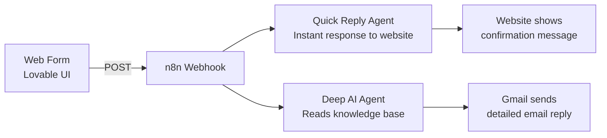
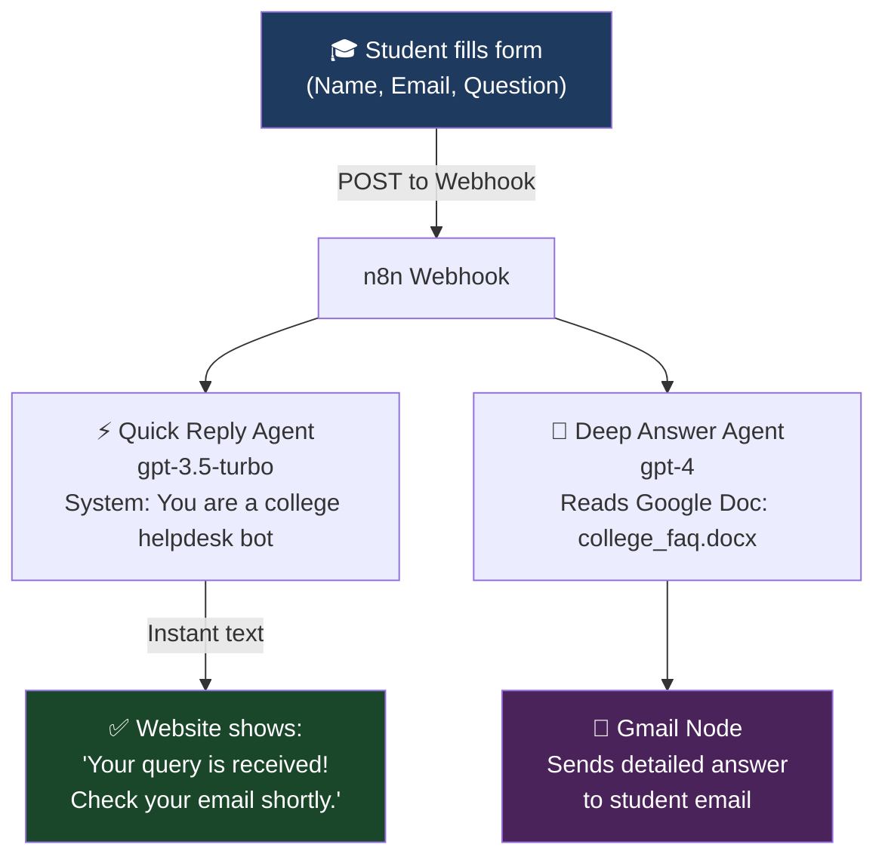
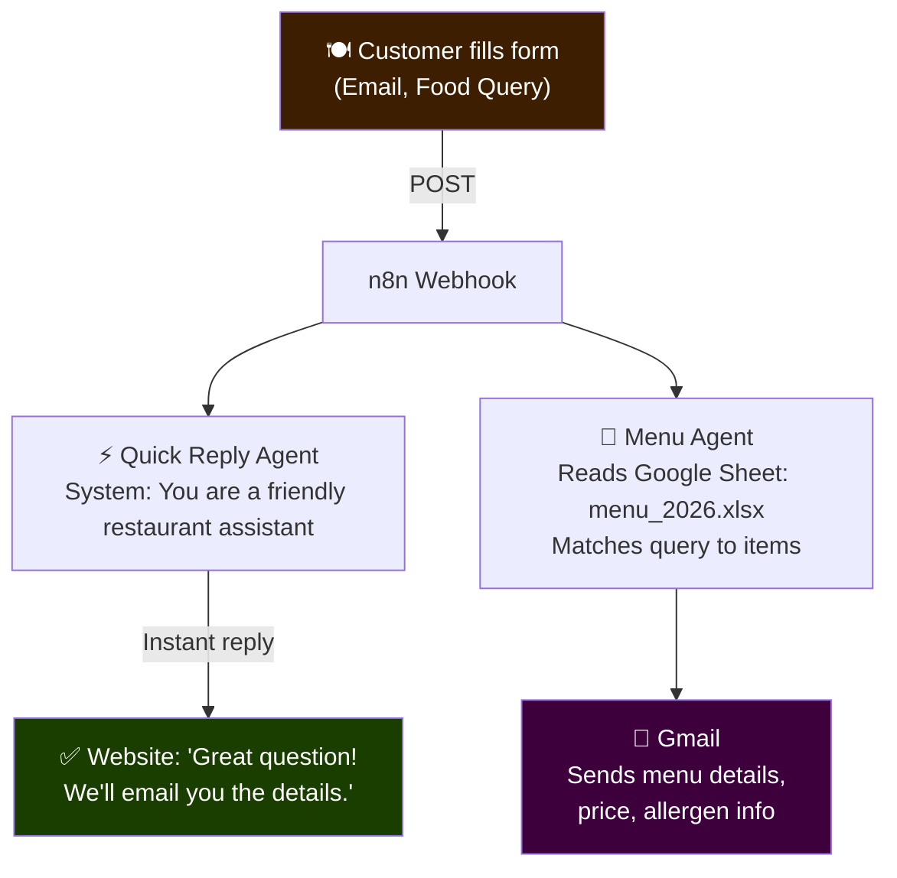
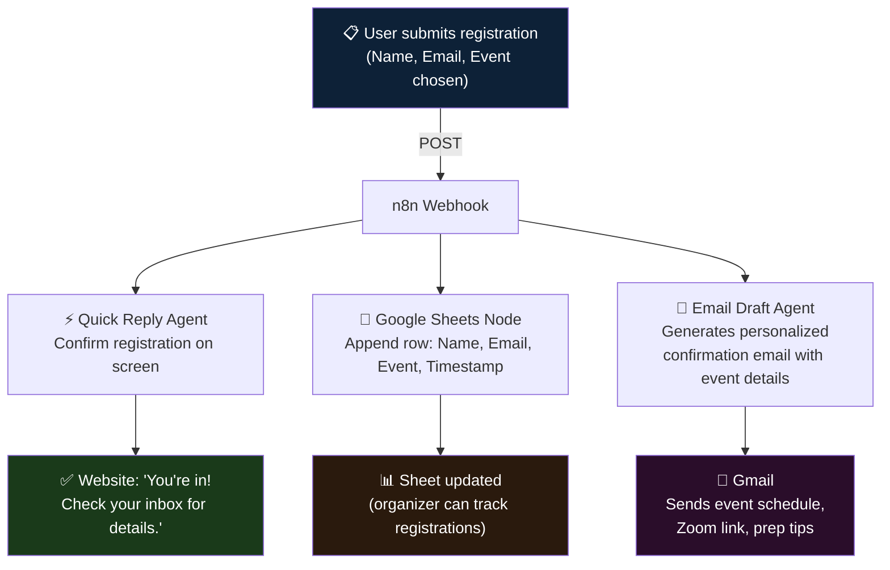
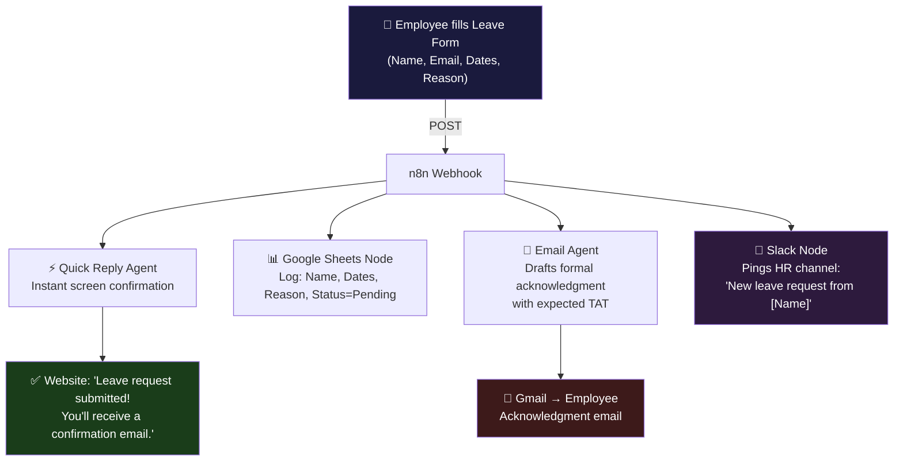
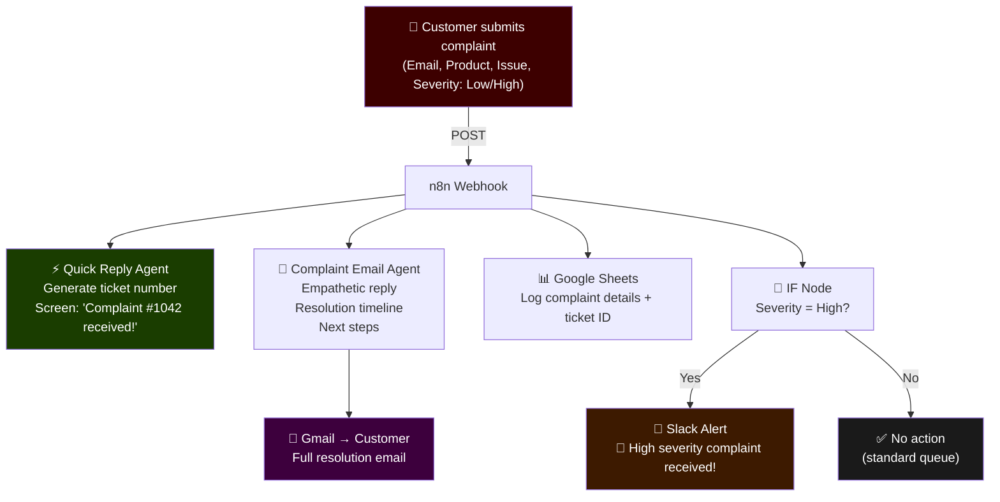

# 🚀 n8n Beginner Projects — Build Your Own AI-Powered Support System

> Inspired by the **Nebula AI Support Bot** — a workflow that takes a web form submission, sends an instant AI reply to the website, and emails a detailed AI-generated response using a knowledge base.

These 5 projects follow the **same architecture pattern**:
> `Web Form → Webhook → AI Agent → Instant Reply + Async Action (Email / Sheet / Notification)`

Each project uses a **Lovable.dev frontend** + **n8n backend**.

---

## 🧠 The Core Pattern You're Replicating

Every project below follows this exact shape. Only the **domain changes**.

---

## 📦 Project 1 — College FAQ Bot

**Use Case:** A student submits a question about admissions, fees, hostel, or syllabus. They get an instant reply on screen + a detailed email answer pulled from a Google Doc FAQ.

**Tools:** Lovable (UI) · n8n Webhook · OpenAI · Google Docs Tool · Gmail

**What beginners learn:**
- Parallel branches in n8n
- Google Docs as a knowledge base
- Structured output parser for email subject + body

---

## 📦 Project 2 — Restaurant Menu Query Bot

**Use Case:** A customer visits a restaurant's website, types a query like "Do you have vegan options?" or "What's today's special?". They get an instant reply + a detailed email with recommendations.

**Tools:** Lovable (UI) · n8n Webhook · OpenAI · Google Sheets Tool · Gmail

**What beginners learn:**
- Google Sheets as a dynamic menu database
- How to prompt an agent to "search" structured data
- Real-world customer-facing automation

---

## 📦 Project 3 — Event Registration Confirmation Bot

**Use Case:** A user registers for a workshop or webinar via a form. They get an instant "You're registered!" message on screen + a detailed confirmation email with schedule, zoom link, and prep material.

**Tools:** Lovable (UI) · n8n Webhook · OpenAI · Google Sheets (registrations log) · Gmail

**What beginners learn:**
- Three parallel branches (not just two!)
- Google Sheets as a live registration log
- Combining data storage + AI email generation

---

## 📦 Project 4 — HR Leave Request Bot

**Use Case:** An employee submits a leave request via an internal portal. HR gets notified on Slack instantly. The employee gets a formal acknowledgment email. The request is logged in Google Sheets.

**Tools:** Lovable (UI) · n8n Webhook · OpenAI · Google Sheets · Gmail · Slack

**What beginners learn:**
- Four parallel branches
- Slack integration (new tool!)
- Real enterprise workflow simulation

---

## 📦 Project 5 — Product Complaint Handler Bot

**Use Case:** A customer submits a product complaint on an e-commerce site. They get an instant apology + ticket number on screen. A detailed empathetic email is sent. The complaint is logged. High-severity complaints trigger a Slack alert.

**Tools:** Lovable (UI) · n8n Webhook · OpenAI · Google Sheets · Gmail · Slack · IF Node

**What beginners learn:**
- IF Node (conditional logic — most important n8n concept!)
- Dynamic ticket ID generation
- Real-world complaint triage automation

---

## 🗺️ Choosing Your Project

| Project | Domain | New Tool Introduced | Difficulty |
|---|---|---|---|
| 1. College FAQ Bot | Education | Google Docs Tool | ⭐ Easiest |
| 2. Restaurant Menu Bot | F&B | Google Sheets Tool | ⭐ Easiest |
| 3. Event Registration Bot | Events | Sheets + 3 branches | ⭐⭐ Easy |
| 4. HR Leave Request Bot | Enterprise | Slack Node | ⭐⭐ Easy |
| 5. Product Complaint Bot | E-commerce | IF Node (conditional) | ⭐⭐⭐ Medium |

> **Recommended for first-timers:** Start with Project 1 or 2. Once comfortable, upgrade to Project 5 to learn conditional logic.

---

## 🛠️ Common Stack for All Projects

| Layer | Tool | Purpose |
|---|---|---|
| Frontend UI | Lovable.dev | Build the web form |
| Automation Backend | n8n | Orchestrate the workflow |
| AI Brain | OpenAI (gpt-3.5 / gpt-4) | Generate replies |
| Knowledge Base | Google Docs / Sheets | Store FAQs, menus, policies |
| Email Delivery | Gmail Node | Send detailed responses |
| Notifications | Slack Node | Alert teams (Projects 4 & 5) |
| Conditional Logic | IF Node | Route based on data (Project 5) |

---

## 📌 What to Submit

For each project, students should submit:

1. **Lovable UI link** (public share URL)
2. **n8n workflow JSON** (exported from n8n → Download)
3. **Screenshot** of a successful form submission + email received
4. **1-paragraph writeup**: What does your bot do? Who is it for?

---

*Built as part of the AI Product Management curriculum — IITP / MASAI cohort*
