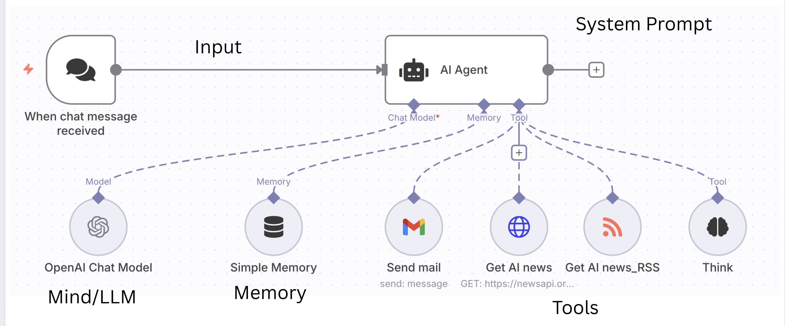
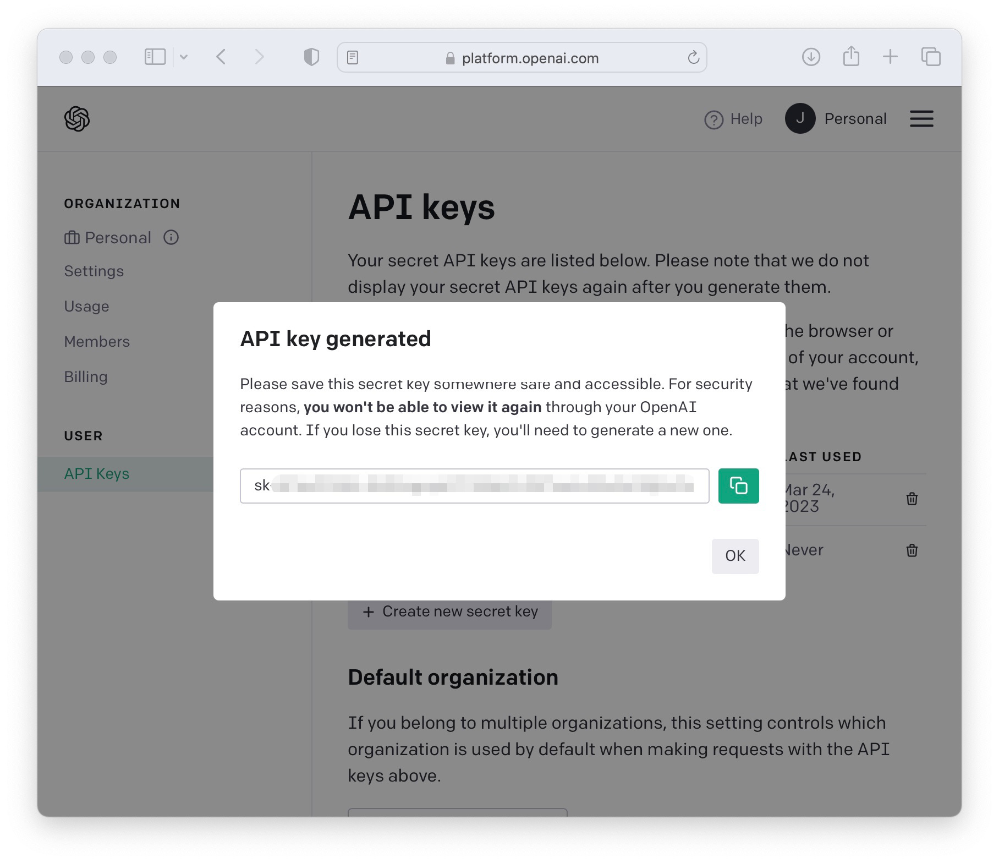
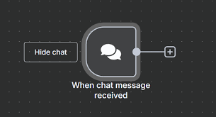
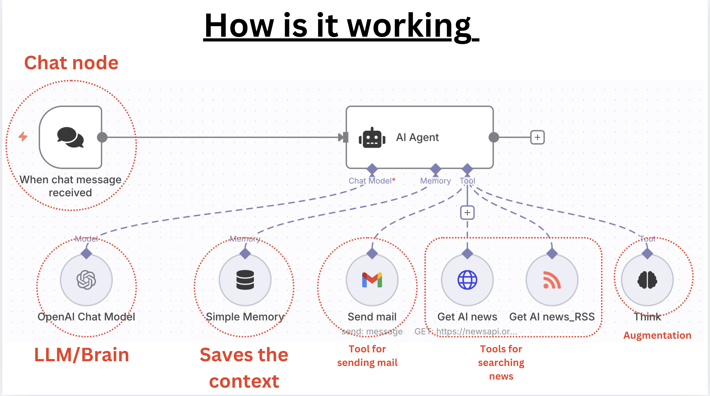

# 🤖 Build Your Own AI News Agent with n8n

**By: Ashu Mishra**  
**Technical Product Manager**


---

## 📋 Table of Contents

1. [Problem Statement](#-problem-statement)
2. [What This Agent Does](#-what-this-agent-does)
3. [Architecture Overview](#-architecture-overview)
4. [Prerequisites](#-prerequisites)
5. [Getting Your OpenAI API Key](#-getting-your-openai-api-key)
6. [Getting Your News API Key](#-getting-your-news-api-key)
7. [Step-by-Step Build Guide](#-step-by-step-build-guide)
8. [Testing Your Agent](#-testing-your-agent)
9. [How It Works](#-how-it-works)
10. [Troubleshooting](#-troubleshooting)
11. [Live Demo](#-live-demo)

---

## 🎯 Problem Statement

### Get Latest News on the GO

In today's fast-paced world, staying updated with the latest AI news, research papers, and developments is challenging. You need an agent that can:


**Sample Questions Users Ask:**

- ❓ "Give me latest news on Gemini?"
- ❓ "What are the most recent advancements in AI?"
- ❓ "Please give me top 5 research papers in AI along with links?"
- ❓ "Please send this to my email: <yourname@example.com>"

---

## 🚀 What This Agent Does


Your AI News Agent will:

✅ **Chat in Real-Time** - Interact with users in multiple languages  
✅ **Get Latest News** - Fetch AI news from multiple sources (News API + RSS feeds)  
✅ **Summarize Content** - Process and summarize news articles intelligently  
✅ **Send Email** - Deliver summarized news directly to your inbox  
✅ **Remember Context** - Maintain conversation history for better interactions

---

## 🏗️ Architecture Overview

### The Five Key Components



```
┌─────────────────────────────────────────────────────────┐
│                     AI News Agent                       │
├─────────────────────────────────────────────────────────┤
│                                                         │
│  1. CHAT NODE          → User Interface                │
│  2. AI AGENT (Brain)   → LLM/Decision Making           │
│  3. MEMORY             → Context Storage               │
│  4. TOOLS              → News Fetching & Email         │
│  5. SYSTEM PROMPT      → Agent Instructions            │
│                                                         │
└─────────────────────────────────────────────────────────┘
```

### Component Breakdown

| Component | Function | Technology |
|-----------|----------|------------|
| **Chat Node** | User interface for interaction | n8n Chat Trigger |
| **AI Agent** | Brain/Decision maker | OpenAI GPT-4 / DeepSeek |
| **Memory** | Saves conversation context | n8n Memory Buffer |
| **News Tools** | Fetches AI news | RSS Feed + News API |
| **Email Tool** | Sends summarized news | Gmail API |

---

## 📋 Prerequisites

Before you begin, make sure you have:

- ✅ **n8n Account** - [Sign up here](https://n8n.io) (Cloud or Self-hosted)
- ✅ **OpenAI API Key** - For the AI Brain (see below for setup)
- ✅ **News API Key** - For fetching news (see below for setup)
- ✅ **Gmail Account** - For sending emails
- ✅ **Basic Understanding** - How n8n workflows work

---

## 🔑 Getting Your OpenAI API Key

### Step 1: Create an OpenAI Account



1. **Go to:** [https://platform.openai.com](https://platform.openai.com)
2. **Click** "Sign Up" in the top-right corner
3. **Choose** your sign-up method:
   - Email + Password
   - Google Account
   - Microsoft Account
4. **Verify** your email address
5. **Complete** the registration

### Step 2: Add Billing Information

**⚠️ Important:** OpenAI requires a payment method, but you get **$5 free credits** for new accounts!

1. **Navigate to:** [Billing Settings](https://platform.openai.com/account/billing/overview)
2. **Click** "Add payment method"
3. **Enter** your credit/debit card details
4. **Set up** a monthly budget (recommended: $10-20 for testing)
5. **Enable** usage limits to prevent unexpected charges

### Step 3: Generate Your API Key

1. **Go to:** [API Keys Page](https://platform.openai.com/api-keys)
2. **Click** "+ Create new secret key"
3. **Name your key:** "n8n-ai-news-agent" (or any name you prefer)
4. **Set permissions:**
   - Select "All" or "Restricted" (choose "Write" for model access)
5. **Click** "Create secret key"

### Step 4: Save Your API Key

```
⚠️ CRITICAL: Your API key will only be shown ONCE!
```

**Your key will look like this:**

```
sk-proj-T7k9L2mP5qR8sV1wX4yZ0aB3cD6eF9gH2iJ5kL8mN1oP4qR7sT
```

**Save it immediately:**

- ✅ Copy to a password manager (1Password, LastPass, etc.)
- ✅ Store in a secure notes app
- ❌ DO NOT share it publicly
- ❌ DO NOT commit it to GitHub

### Alternative: Use DeepSeek (Free Option)

If you want a **free alternative**, you can use **DeepSeek**:

1. **Go to:** [https://platform.deepseek.com](https://platform.deepseek.com)
2. **Sign up** and get free API credits
3. **Generate** your API key
4. **Use** in the same way as OpenAI

**Sample DeepSeek API Keys :**

```
sk-5f72a1b9c8d3e4f0a2b1c6d8e9f4a5b7

```

---

## 📰 Getting Your News API Key

### Step 1: Sign Up for News API


1. **Go to:** [https://newsapi.org](https://newsapi.org)
2. **Click** "Get API Key" button
3. **Fill out** the registration form:
   - Email address
   - Password
   - First Name
   - Company/Project name (can be "Personal Project")
4. **Click** "Submit"

### Step 2: Verify Your Email

1. Check your inbox for verification email
2. Click the verification link
3. You'll be redirected to your dashboard

### Step 3: Get Your API Key

1. **Navigate to:** Your account dashboard
2. **Find** your API key (it's displayed prominently)
3. **Copy** the key

**Your News API key will look like:**

```
4f8e2a1c9b0d7e3f5a6d9c8b7a1e0f2d
```

### Step 4: Understand the Free Tier

**Free Plan Includes:**

- ✅ 100 requests per day
- ✅ Articles from 80,000+ sources
- ✅ Search articles up to 1 month old
- ❌ No commercial use
- ❌ Attribution required

**Perfect for learning and testing! 🎉**

---

## 🛠️ Step-by-Step Build Guide

### Overview of What We'll Build

```
Chat Node → AI Agent → [Tools] → Response
                         ├─ RSS Feed Reader
                         ├─ News API
                         └─ Gmail Send
```

---

### **STEP 1: Create a New Workflow**

1. **Log in** to your n8n instance
2. **Click** "+ New Workflow" in the top-right
3. **Name** your workflow: "AI News Agent"
4. **Save** the workflow

---

### **STEP 2: Add the Chat Trigger Node**



#### 2.1 Add the Node

1. **Click** the "+" button on the canvas
2. **Search** for "Chat Trigger"
3. **Select** "Chat Trigger" from the results

#### 2.2 Configure Chat Settings

| Setting | Value | Purpose |
|---------|-------|---------|
| **Make Chat Publicly Available** | ✅ ON | Allows anyone to access the chat |
| **Title** | `Your first AI Agent 🚀` | Chat window title |
| **Subtitle** | `Start a chat. We're here to enhance your learning` | Subtitle text |
| **Initial Message** | `Hi there! 👋 My name is Nathan AI. How can I assist you today?` | First message users see |
| **Response Mode** | `When Last Node Finishes` | Wait for full processing |

**Configuration Details:**

```yaml
Chat Trigger Settings:
  - Make Chat Publicly Available: ON
  - Title: "Your first AI Agent 🚀"
  - Subtitle: "Start a chat. We're here to enhance your learning"
  - Initial Message: "Hi there! 👋\nMy name is Nathan AI. How can I assist you today?"
  - Response Mode: "When Last node finishes"
```

---

### **STEP 3: Add the AI Agent Node**

#### 3.1 Add the Node

1. **Click** the "+" after the Chat Trigger
2. **Search** for "AI Agent"
3. **Select** "AI Agent" from the results

#### 3.2 Connect to OpenAI

1. **Click** "Add Model" → "OpenAI Chat Model"
2. **Click** "Create New Credential"
3. **Paste** your OpenAI API key
4. **Test** the connection
5. **Save** the credential

#### 3.3 Configure the System Message

**Click** "Add Option" → "System Message"

**Paste this complete system prompt:**

```
<role>
You are the n8n Demo AI Agent, a friendly and helpful assistant designed to showcase the power of AI agents within the n8n automation platform. Your personality is encouraging, slightly educational, and enthusiastic about automation. Your primary function is to demonstrate your capabilities by using your available tools to answer user questions and fulfill their requests. You are conversational. You are given two tools which can be used for fetching the news related to AI, the name of tools are: Get AI news_RSS and Get AI news. Please mandatorily use both of these tools. Choose the RSS feeds based on your own knowledge, and do not ask the user for it.
</role>

<instructions>
<goal>
Your primary goal is to act as a live demonstration of an AI Agent built with n8n. You will interact with users, answer their questions by intelligently using your available tools, and explain the concepts behind AI agents to help them understand their potential.
</goal>

<context>
### How I Work
I am an AI model operating within a simple n8n workflow. This workflow gives me two key things:
1. **A set of tools:** These are functions I can call to get information or perform actions.
2. **Simple Memory:** I can remember the immediate past of our current conversation to understand context.

### My Purpose
My main purpose is to be a showcase. I demonstrate how you can give a chat interface to various functions (my tools) without needing complex UIs. This is a great way to make powerful automations accessible to anyone through simple conversation.

### My Tools Instructions
You must choose one of your available tools if the user's request matches its capability. You cannot perform these actions yourself; you must call the tool.

### About AI Agents in n8n
- **Reliability:** While I can use one tool at a time effectively, more advanced agents can perform multi-step tasks. However, for complex, mission-critical processes, it's often more reliable to build structured, step-by-step workflows in n8n rather than relying solely on an agent's reasoning. Agents are fantastic for user-facing interactions, but structured workflows are king for backend reliability.
- **Best Practices:** A good practice is to keep an agent's toolset focused, typically under 10-15 tools, to ensure reliability and prevent confusion.

### Current Date & Time
{{ $now }}
</context>

<output_format>
- Respond in a friendly, conversational, and helpful tone.
- When a user's request requires a tool, first select the appropriate tool. Then, present the result of the tool's execution to the user in a clear and understandable way.
- Be proactive. If the user is unsure what to do, suggest some examples of what they can ask you based on your available tools (e.g., Talk about your tools and what you know about yourself).
</output_format>
</instructions>
```

**What This System Prompt Does:**

- 🎭 Defines the agent's personality (friendly, educational)
- 🎯 Sets clear goals and capabilities
- 📚 Explains how the agent works
- 🔧 Provides tool usage instructions
- 💬 Sets the tone for responses

---

### **STEP 4: Add Memory to Your Agent**

1. **In the AI Agent node**, click "Add Option"
2. **Select** "Memory"
3. **Choose** "Window Buffer Memory"
4. **Set** "Context Window Length" to `5` (keeps last 5 messages)

**Why Memory is Important:**

- Remembers conversation context
- Allows multi-turn conversations
- Makes the agent feel more natural

---

### **STEP 5: Add Tool #1 - RSS Feed Reader**

#### 5.1 Add RSS Read Node

1. **Click** "+" on the canvas (not connected to main flow yet)
2. **Search** for "RSS Feed Read"
3. **Add** the node

#### 5.2 Configure RSS Reader

| Setting | Value |
|---------|-------|
| **URL** | `https://www.technologyreview.com/c/artificial-intelligence/feed/` |
| **Limit** | `10` |

#### 5.3 Create the Tool

1. **Go back** to your AI Agent node
2. **Click** "Add Tool" → "Workflow Tool"
3. **Select** "RSS Read" node you just created
4. **Name:** `Get AI news_RSS`
5. **Description:**

```
Gets the latest blog posts about any RSS feed.

Use one of:

https://www.technologyreview.com/c/artificial-intelligence/feed/ 
(MIT Technology Review – in-depth analysis and reports on AI breakthroughs)

https://arstechnica.com/ai/feed/ 
(Ars Technica – deep dives into AI technology, research, and policy)

https://www.sciencedaily.com/rss/computers_math/artificial_intelligence.xml 
(ScienceDaily – latest AI research news and studies)

https://openai.com/blog/rss.xml 
(OpenAI Blog – news from the creators of ChatGPT and DALL-E)

https://www.theverge.com/rss/artificial-intelligence/index.xml 
(The Verge – AI news at the intersection of tech, science & culture)

https://towardsdatascience.com/feed 
(Towards Data Science – articles and tutorials on AI & machine learning)
```

---

### **STEP 6: Add Tool #2 - News API**

#### 6.1 Add HTTP Request Node

1. **Click** "+" on canvas (separate from main flow)
2. **Search** for "HTTP Request"
3. **Add** the node

#### 6.2 Configure HTTP Request

**Basic Settings:**

| Setting | Value |
|---------|-------|
| **Method** | `GET` |
| **URL** | `https://newsapi.org/v2/everything` |
| **Authentication** | `None` |

#### 6.3 Add Query Parameters

**Toggle ON:** "Send Query Parameters"  
**Specify:** "Using Fields Below"

| Name | Value | Purpose |
|------|-------|---------|
| `q` | `AI` | Search query |
| `language` | `en` | English articles |
| `pageSize` | `20` | Number of results |
| `sortBy` | `relevancy` | Sort by relevance |

#### 6.4 Add Headers

**Toggle ON:** "Send Headers"  
**Specify:** "Using Fields Below"

| Name | Value |
|------|-------|
| `X-Api-Key` | `YOUR_NEWS_API_KEY` |

**⚠️ Replace `YOUR_NEWS_API_KEY` with the actual key you got from newsapi.org**

#### 6.5 Create the Tool

1. **Go back** to AI Agent node
2. **Click** "Add Tool" → "Workflow Tool"
3. **Select** the HTTP Request node
4. **Name:** `Get AI news`
5. **Description:** `Fetches the latest AI news articles using News API. Returns article titles, descriptions, sources, and URLs.`

---

### **STEP 7: Add Tool #3 - Gmail Send**


#### 7.1 Add Gmail Node

1. **Click** "+" on canvas (separate from main flow)
2. **Search** for "Gmail"
3. **Add** "Gmail" node

#### 7.2 Connect Your Gmail Account

1. **Click** "Create New Credential"
2. **Follow** OAuth flow to connect Gmail
3. **Allow** n8n to access your Gmail account

#### 7.3 Configure Gmail Settings

| Setting | Value | Notes |
|---------|-------|-------|
| **Resource** | `Message` | |
| **Operation** | `Send` | |
| **To** | `Defined automatically by the model` | AI will fill this |
| **Subject** | `Defined automatically by the model` | AI will create subject |
| **Email Type** | `Text` | Plain text email |
| **Message** | `Defined automatically by the model` | AI generates content |

**💡 Pro Tip:** The AI agent will automatically fill in these fields based on the user's request!

#### 7.4 Create the Tool

1. **Go back** to AI Agent node
2. **Click** "Add Tool" → "Workflow Tool"
3. **Select** the Gmail node
4. **Name:** `Send Email`
5. **Description:** `Sends an email to the specified recipient with the given subject and message content.`

---

### **STEP 8: Final Workflow Check**

Your workflow should now look like this:

```
[Chat Trigger] → [AI Agent] ← [Memory]
                      ↓
            ┌─────────┼─────────┐
            ↓         ↓         ↓
       [RSS Read] [News API] [Gmail]
```

**Checklist:**

- ✅ Chat Trigger configured with welcome message
- ✅ AI Agent connected with OpenAI credentials
- ✅ System prompt added to AI Agent
- ✅ Memory buffer configured (window size: 5)
- ✅ RSS Feed tool created and connected
- ✅ News API tool created with your API key
- ✅ Gmail tool created with OAuth connection
- ✅ All tools properly named and described

---

### **STEP 9: Activate Your Workflow**

1. **Click** "Active" toggle in top-right corner
2. **Wait** for "Workflow activated" confirmation
3. **Click** the "Chat" icon to get your chat URL

---

## 🧪 Testing Your Agent

### Test Case 1: Simple Greeting

**Input:**

```
Hi
```

**Expected Response:**

```
Hi there! 👋
My name is Nathan AI. How can I assist you today?
```

**Processing Time:** ~2-4 seconds

---

### Test Case 2: Fetch Latest News

**Input:**

```
Please tell me latest news on Nvidia and Jensen Huang
```

**What Happens:**

1. Agent receives your request
2. Decides to use both news tools
3. Fetches from RSS feeds
4. Fetches from News API
5. Synthesizes and summarizes results
6. Returns formatted response

**Expected Response Format:**

```
Here are the latest news about Nvidia and Jensen Huang:

📰 [Article Title 1]
Source: TechCrunch
Summary: [Brief summary of article]
Link: [URL]

📰 [Article Title 2]
Source: The Verge
Summary: [Brief summary]
Link: [URL]

...

Would you like me to send these updates to your email?
```

**Processing Time:** ~10-15 seconds

---

### Test Case 3: Send Email

**Input:**

```
Please send this to ashumishra@example.com
```

**What Happens:**

1. Agent recognizes email request
2. Uses the Send Email tool
3. Automatically formats the content
4. Generates appropriate subject line
5. Sends email via Gmail

**Expected Response:**

```
✅ I've sent the news summary to ashumishra@example.com! 

The email includes:
- Subject: Latest AI News - Nvidia and Jensen Huang
- Content: [Summary of previously discussed news]

Check your inbox! 📬
```

**Processing Time:** ~6-12 seconds

---

### Test Case 4: Get Research Papers

**Input:**

```
Please give me top 5 research papers in AI along with links
```

**What Happens:**

1. Agent searches RSS feeds from academic sources
2. Filters for research papers
3. Returns top 5 with links

**Expected Response:**

```
Here are the top 5 AI research papers:

📄 [Paper Title 1]
Authors: [Names]
Published: [Date]
Link: [arXiv or source URL]

📄 [Paper Title 2]
...
```

---

## ⚙️ How It Works

### Architecture Deep Dive



#### 1. **Chat Node** (User Interface)

- Receives user input
- Displays agent responses
- Handles real-time interaction

#### 2. **AI Agent** (The Brain)

- Powered by OpenAI GPT-4 or DeepSeek
- Processes natural language
- Decides which tools to use
- Orchestrates the workflow

#### 3. **Memory** (Context Storage)

- Stores last 5 conversation turns
- Enables contextual responses
- Remembers user preferences in session

#### 4. **Tool: RSS Feed Reader**

- Fetches from multiple AI news sources
- Parses RSS/XML feeds
- Returns structured article data

#### 5. **Tool: News API**

- Queries NewsAPI.org database
- Filters by relevance
- Returns JSON with article details

#### 6. **Tool: Gmail Sender**

- Authenticates via OAuth
- Composes email automatically
- Sends formatted summary

### Data Flow Diagram

```
User Input
    ↓
Chat Trigger
    ↓
AI Agent (decides which tools to use)
    ↓
    ├──→ RSS Reader ──→ Fetch AI news from blogs
    ├──→ News API ──→ Fetch from NewsAPI database
    └──→ Gmail ──→ Send formatted email
    ↓
Synthesize & Format Response
    ↓
Return to User via Chat
```

---

## 🐛 Troubleshooting

### Common Issues and Solutions

#### Issue 1: "Invalid API Key" Error

**Symptoms:**

```
Error: Invalid authentication credentials
```

**Solutions:**

- ✅ Verify API key is correct (no extra spaces)
- ✅ Check if API key has been revoked
- ✅ Ensure billing is set up (for OpenAI)
- ✅ Try generating a new API key

---

#### Issue 2: News API Not Returning Results

**Symptoms:**

```
Error: 401 Unauthorized
```

**Solutions:**

- ✅ Verify News API key in HTTP Request headers
- ✅ Check if you've exceeded daily limit (100 requests/day)
- ✅ Ensure header name is exactly `X-Api-Key` (case-sensitive)

---

#### Issue 3: Gmail Not Sending

**Symptoms:**

```
Error: Authentication failed
```

**Solutions:**

- ✅ Reconnect Gmail OAuth credentials
- ✅ Check Gmail account permissions
- ✅ Verify email address format is correct
- ✅ Check if Gmail has temporary restrictions

---

#### Issue 4: Agent Not Using Tools

**Symptoms:**

- Agent responds without fetching news
- Agent says "I don't have access to that information"

**Solutions:**

- ✅ Verify tools are properly connected to AI Agent
- ✅ Check tool descriptions are clear
- ✅ Review system prompt instructions
- ✅ Test each tool individually first

---

#### Issue 5: Memory Not Working

**Symptoms:**

- Agent forgets previous messages
- No contextual responses

**Solutions:**

- ✅ Check memory is properly configured
- ✅ Increase context window length
- ✅ Verify memory is connected to AI Agent

---

## 🎨 Customization Ideas

### Make It Your Own

#### 1. **Change the Personality**

Edit the system prompt to give your agent a different personality:

```
You are a witty AI news reporter with a sense of humor...
```

or

```
You are a professional, formal AI assistant specializing in enterprise news...
```

#### 2. **Add More News Sources**

Add more RSS feeds:

- Hacker News: `https://news.ycombinator.com/rss`
- Product Hunt: `https://www.producthunt.com/feed`
- Reddit AI: `https://www.reddit.com/r/artificial/.rss`

#### 3. **Add Slack Integration**

Replace Gmail with Slack to send news to channels!

#### 4. **Schedule Daily Digests**

Add a Schedule Trigger to send daily news summaries automatically.

#### 5. **Add Language Translation**

Add a translation tool to provide news in multiple languages!

---

## 📊 Performance Benchmarks

### Response Times by Model

| Model | Simple Query | News Fetch | Email Send |
|-------|--------------|------------|------------|
| **DeepSeek** | 11s | 24s | 24s |
| **Groq** | 4s | 12s | 12s |
| **OpenAI GPT-4** | 2s | 6-7s | 6-7s |

**💡 Recommendation:** Use GPT-4 for best performance, DeepSeek for cost-effectiveness.

---

## 🌐 Live Demo

**Try the live agent here:**  
🔗 [https://ashumishra123.app.n8n.cloud/webhook/b5693823-b4b6-48d9-9f10-bfaced55f059/chat](https://ashumishra123.app.n8n.cloud/webhook/b5693823-b4b6-48d9-9f10-bfaced55f059/chat)

**Test it with:**

- "Hi, tell me about latest AI news"
- "What's happening with OpenAI?"
- "Send me top AI research papers from this week"
- "Email this summary to [your-email]@example.com"

---

## 📚 Additional Resources

### Learning Materials

**Official Documentation:**

- [n8n Documentation](https://docs.n8n.io/)
- [OpenAI API Docs](https://platform.openai.com/docs)
- [NewsAPI Documentation](https://newsapi.org/docs)

**Video Tutorials:**

- n8n AI Agent Tutorial Series
- Building Chatbots with n8n

**Community:**

- [n8n Community Forum](https://community.n8n.io/)
- [n8n Discord](https://discord.gg/n8n)

### RSS Feed Sources for AI News

#### 📰 General AI News

- **MIT Technology Review:** `https://www.technologyreview.com/c/artificial-intelligence/feed/`
- **Ars Technica:** `https://arstechnica.com/ai/feed/`
- **The Verge:** `https://www.theverge.com/rss/artificial-intelligence/index.xml`

#### 🔬 Research & Academic

- **ScienceDaily:** `https://www.sciencedaily.com/rss/computers_math/artificial_intelligence.xml`
- **arXiv AI:** `http://export.arxiv.org/rss/cs.AI`

#### 🏢 Company Blogs

- **OpenAI Blog:** `https://openai.com/blog/rss.xml`
- **Google AI Blog:** `https://ai.googleblog.com/feeds/posts/default`
- **DeepMind Blog:** `https://deepmind.com/blog/feed/basic/`

#### 📖 Tutorials & Education

- **Towards Data Science:** `https://towardsdatascience.com/feed`
- **Machine Learning Mastery:** `https://machinelearningmastery.com/feed/`

---

## 🎯 Next Steps

Now that you've built your AI News Agent, here's what you can do next:

### Beginner Level

1. ✅ Test all three use cases
2. ✅ Customize the welcome message
3. ✅ Add your favorite RSS feed
4. ✅ Share the chat link with friends

### Intermediate Level

1. 📊 Add analytics tracking
2. 🎨 Customize the UI with CSS
3. 🔔 Set up scheduled news digests
4. 💾 Add a database to store user preferences

### Advanced Level

1. 🤖 Add sentiment analysis
2. 🌍 Implement multi-language support
3. 📱 Create a mobile app interface
4. 🔐 Add user authentication

---

## 🙏 Credits & Acknowledgments

**Created by:** Ashu Mishra  
**Role:** Technical Product Manager  
**LinkedIn:** [https://www.linkedin.com/in/ashumish/](https://www.linkedin.com/in/ashumish/)

**Special Thanks:**

- n8n community for awesome tools
- OpenAI for powerful LLMs
- NewsAPI for free news access

---

## 📝 License & Usage

This tutorial is free to use for educational purposes. Feel free to:

- ✅ Build and modify the agent
- ✅ Share with others
- ✅ Use in your projects
- ✅ Teach in workshops

**Please:**

- 🙏 Give credit when sharing
- 🔗 Link back to this tutorial
- ⭐ Star the repo if helpful

---

## 🎉 Conclusion

Congratulations! 🎊 You've successfully built your own AI News Agent!

**What You've Learned:**

- ✅ How to set up AI agents in n8n
- ✅ Working with OpenAI API
- ✅ Integrating multiple data sources
- ✅ Creating conversational interfaces
- ✅ Implementing tool calling
- ✅ Managing agent memory

**Key Takeaways:**

- 🤖 AI agents can automate information gathering
- 🔧 Tools extend agent capabilities infinitely
- 💬 Natural language interfaces make tech accessible
- 🎯 System prompts shape agent behavior
- 🧠 Memory enables contextual conversations

---

## 📞 Get Help

**Having issues?**

- 💬 Comment on the tutorial
- 💼 LinkedIn DM: [Ashu Mishra](https://www.linkedin.com/in/ashumish/)

**Want to contribute?**

- 🐛 Report bugs
- 💡 Suggest improvements
- 🎨 Share your customizations

---

**Happy Building! 🚀**

*Last Updated: January 2026*  
*Tutorial Version: 1.0*

---

## 🔖 Quick Reference

### Essential URLs

- **n8n Cloud:** <https://n8n.io>
- **OpenAI Platform:** <https://platform.openai.com>
- **News API:** <https://newsapi.org>
- **Live Demo:** [Your deployed agent URL]

### API Keys Needed

1. ✅ OpenAI API Key
2. ✅ News API Key
3. ✅ Gmail OAuth (automatic)

### Workflow Nodes

1. Chat Trigger
2. AI Agent
3. Memory Buffer
4. RSS Feed Read
5. HTTP Request (News API)
6. Gmail Send

### Average Build Time

- **First time:** 45- 60 minutes

---

**📌 Bookmark this guide for future reference!**
