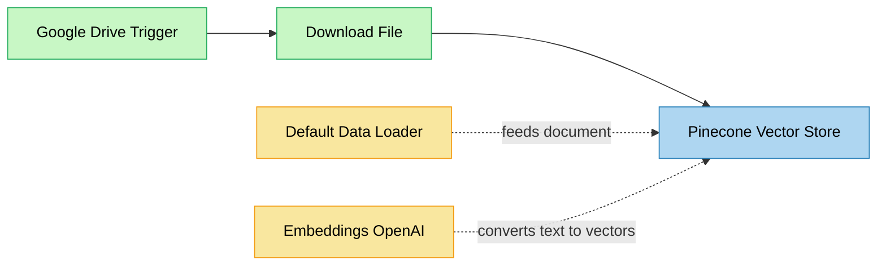
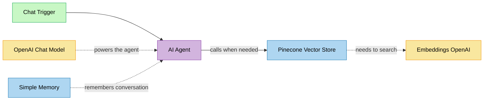

# 🤖 Building a RAG Agent with n8n + Pinecone — Complete DIY Guide

> **📊 Step-by-step Reference Sheet (Google Sheets):** [Click here to access the detailed step-by-step guide](https://docs.google.com/spreadsheets/d/19wGfOP38LQfUwmXNwd13IxKzgBhPcPsB81pTLgQjsYM/edit?usp=sharing)

---

## 📚 Overview

This guide walks you through building a **Retrieval-Augmented Generation (RAG) Agent** using n8n, Pinecone, and OpenAI. By the end, you'll have a fully working AI chatbot that answers questions from your own documents — without hallucinating data that isn't there.

**What you'll build:**
- **Part 1** — An automated document ingestion pipeline (Google Drive → Pinecone)
- **Part 2** — An AI chatbot that retrieves and answers from your vector database

**Use Case Example:** An iOS 18 assistant that answers user questions strictly based on uploaded iOS 18 documentation.

---

## 🎯 Prerequisites

Before starting, ensure you have the following accounts and credentials ready:

| Requirement | Link |
|---|---|
| n8n Account | [n8n.io](https://n8n.io/) |
| Google Drive Account | [drive.google.com](https://drive.google.com/) |
| OpenAI API Key | [platform.openai.com](https://platform.openai.com/) |
| Pinecone Account | [pinecone.io](https://www.pinecone.io/) |

---

## 🔀 Flow Diagrams

> **How to read these diagrams:**
> - **Solid arrows** `-->` = main data flow (left to right / top to bottom)
> - **Dotted arrows** `-.->` = sub-node connection (a helper plugged into a main node, not a step in the chain)

---

### Part 1 — Loading Data into Pinecone



**What each node does:**

| Node | Type | Role |
|---|---|---|
| Google Drive Trigger | Main flow | Watches your folder — fires when a new file is uploaded |
| Download File | Main flow | Downloads the file content from Drive into n8n |
| Pinecone Vector Store | Main flow | Stores the processed document as vectors in Pinecone |
| Default Data Loader | Sub-node | Reads the raw file and prepares it for processing |
| Embeddings OpenAI | Sub-node | Converts text chunks into numbers (vectors) so Pinecone can store and search them |

---

### Part 2 — Retrieving Data via Chatbot



**What each node does:**

| Node | Type | Role |
|---|---|---|
| Chat Trigger | Main flow | Receives the user's message and starts the workflow |
| AI Agent | Main flow | The brain — decides what to do, calls Pinecone when it needs information |
| Pinecone Vector Store | Tool (called by Agent) | Searches the vector database and returns relevant document chunks |
| Embeddings OpenAI | Sub-node of Pinecone | Converts the user's question into a vector so Pinecone can find similar content |
| OpenAI Chat Model | Sub-node of Agent | The GPT-4o model that actually generates the response |
| Simple Memory | Sub-node of Agent | Keeps track of the last 10 messages so the bot remembers context |

---

## 📋 Part 1 — Step-by-Step: Loading Data into Pinecone

### Step 1 — Set Up Your Pinecone Index

Before touching n8n, create your vector database:

1. Go to [https://www.pinecone.io/](https://www.pinecone.io/) and sign in
2. Click **"Create Index"** (top right corner)
3. Give your index a name (e.g., `dummyaccex`)
4. Under **Configuration**, select model: `text-embedding-3-small`
5. Click **"Create Index"**
6. On the left sidebar, click **"API Keys"**
7. Create an API key and copy it — you'll paste it into n8n

---

### Step 2 — Create Workflow in n8n

1. Log in to your n8n account
2. Click **"New Workflow"**
3. Name it: `RAG_loading_data_on_Pinecone_part_1`

---

### Step 3 — Add Google Drive Trigger

| Setting | Value |
|---|---|
| Trigger On | Changes involving a specific folder |
| Poll Times | Every Minute |
| Folder | Your Google Drive folder (e.g. "First RAG agent") |
| Watch for | File Created |

> 💡 **Authenticate** with your Google Drive account when prompted. Create a dedicated folder and upload your PDF documents there.

---

### Step 4 — Add Download File Node

Connect a **Google Drive** node (not the trigger) immediately after.

| Setting | Value |
|---|---|
| Resource | File |
| Operation | Download |
| File (by ID) | `{{ $json.id }}` |

> This expression dynamically picks up the ID of the newly created file from the trigger.

---

### Step 5 — Add Pinecone Vector Store (Insert Mode)

1. Search for **"Pinecone Vector Store"** and add it
2. Choose **"Add document to Vector Store"** (Insert Documents)
3. For **Credentials**, paste in your Pinecone API key
4. Set **Operation Mode** to `Insert Documents`
5. Under **Pinecone Index**, choose `From List` and select your index
6. Set **Embedding Batch Size** to `200`

---

### Step 6 — Add Embeddings OpenAI

1. Add **"Embeddings OpenAI"** node (sub-node of Pinecone)
2. Set **Model**: `text-embedding-3-small`
3. In **Add Option**, choose **Dimensions** → set to `512`
4. Connect your OpenAI credentials

---

### Step 7 — Add Default Data Loader

1. Add **"Default Data Loader"** node (sub-node of Pinecone)
2. Configure:

| Setting | Value |
|---|---|
| Type of Data | Binary |
| Mode | Load All Input Data |
| Data Format | Automatically Detect by MIME type |
| Text Splitting | Simple |

---

### Step 8 — Execute Workflow

1. Save your workflow
2. Click **"Execute Workflow"**
3. Upload a PDF to your Google Drive folder
4. Watch all nodes turn green ✅
5. Check your Pinecone dashboard — you should see vectors being loaded!

---

## 💬 Part 2 — Step-by-Step: Building the Chatbot

### Step 1 — Create New Workflow

1. Create a new workflow in n8n
2. Name it: `RAG_loading_data_on_Pinecone_part_2`

---

### Step 2 — Add Chat Trigger Node

1. Search for **"When Chat Message Received"**
2. Configure:
   - **Make Chat Publicly Available**: ✅ Toggle ON

> This gives you a public chat URL you can share with others.

---

### Step 3 — Add AI Agent

1. Add **"AI Agent"** node and connect it to the Chat Trigger
2. Set **Source for Prompt (User Message)**: Connected Chat Trigger Node
3. Paste the following as the **System Message**:

```
#Role
You are an AI assistant trained to answer questions specifically based on the iOS 18 feature documents stored in the connected vector database.

#Objective
Your job is to help users clearly understand the new features, settings, and changes introduced in iOS 18 — by retrieving and referencing only the information available in the documents stored in the vector store.

If a user asks something that's not included in the uploaded content, or if the answer isn't clear from the available data, let them know that the information isn't currently available.

#Rules
- Be clear and direct — avoid over-explaining. (Use 2-5 sentences)
- Use bullet points or short paragraphs when listing multiple features.
- Never guess or assume — stick strictly to what's inside the vector database content.

Your main objective: Deliver helpful, accurate, and easy-to-understand answers using only the documents available in the vector store — no speculation, no extra assumptions, and no external sources.
```

> ✏️ **Customize this prompt** for your own use case. Just replace "iOS 18" with your document domain.

---

### Step 4 — Attach OpenAI Chat Model

1. Add **"OpenAI Chat Model"** as a sub-node of AI Agent
2. Set **Model**: `gpt-4o`
3. Connect your OpenAI API credentials

---

### Step 5 — Add Simple Memory

1. Add **"Simple Memory"** (Window Buffer Memory) as a sub-node of AI Agent
2. Set **Context Window Length**: `10`

> This allows your bot to remember the last 10 messages in a conversation.

---

### Step 6 — Add Pinecone Vector Store (Retrieve as Tool)

1. Add **"Pinecone Vector Store"** as a tool sub-node of AI Agent
2. Configure:

| Setting | Value |
|---|---|
| Operation Mode | Retrieve Documents (As Tool for AI Agent) |
| Description | Please retrieve the data from this vector store |
| Pinecone Index | From List → Select the same index from Part 1 |
| Limit | 4 |
| Include Metadata | Toggled ON |

---

### Step 7 — Add Embeddings OpenAI (for Retrieval)

1. Add **"Embeddings OpenAI"** as sub-node of Pinecone Vector Store
2. Set **Model**: `text-embedding-3-small`
3. In **Add Option**, choose **Dimensions** → set to `512`

> ⚠️ **This must match** the embedding model and dimensions used in Part 1, otherwise your queries won't match the stored vectors.

---

### Step 8 — Test Your Chatbot

1. Save and **Activate** the workflow
2. Open the public chat URL from the Chat Trigger node
3. Ask questions like:
   - *"What are the new features in iOS 18?"*
   - *"How do I customize the Control Center in iOS 18?"*
   - *"What changed in the Photos app?"*

---

## 🔧 Troubleshooting

**Pinecone index not found**
Make sure you created the index on Pinecone and the name matches exactly what you typed in n8n.

**No vectors returned from search**
Check that Part 1 successfully ran and vectors appear in your Pinecone dashboard. Also verify the embedding dimensions match (512) in both parts.

**Agent not using the vector store**
Check the tool description in the Pinecone node. Make it specific — phrases like "ALWAYS use this tool when..." help the agent decide to use it.

**Embedding dimension mismatch**
Both Part 1 and Part 2 must use the same model (`text-embedding-3-small`) and the same dimensions (`512`). Any mismatch will cause empty search results.

---

## 📊 Understanding the Key Components

**What is RAG?**
RAG = Retrieval-Augmented Generation. Instead of the AI making things up, it first *retrieves* relevant documents, then *generates* an answer based only on those documents.

**What are Embeddings?**
Embeddings convert text into numbers (vectors). Similar meaning = similar numbers = close together in vector space. This is how semantic search works.

**What is Pinecone?**
Pinecone is a managed vector database. It stores your document embeddings and can quickly find the most relevant ones for any query.

**What does the AI Agent do?**
The agent receives the user's question, uses Pinecone as a tool to retrieve context, then asks GPT-4o to generate an answer strictly from that context.

---

## 💡 Tips & Best Practices

- Use **text-based PDFs** — scanned images won't extract well
- Keep embedding model and dimensions **consistent** across both workflows
- Use **namespaces** in Pinecone if you have multiple document sets
- Test with questions your documents clearly answer before going live
- Set a strict system prompt to prevent the agent from hallucinating

---

## 📚 Resources

- [n8n Documentation](https://docs.n8n.io/)
- [OpenAI API Reference](https://platform.openai.com/docs)
- [Pinecone Documentation](https://docs.pinecone.io/)
- [RAG Explained — Pinecone](https://www.pinecone.io/learn/retrieval-augmented-generation/)

---

## 📝 Workflow Reference IDs

| Workflow | n8n ID |
|---|---|
| Part 1 — Load Data | `gtPQOTZmMwMlFo7V` |
| Part 2 — Chatbot | `fPvugshk7InzvwIg` |

---

*Last Updated: February 2026*
*Created by: Ashu Mishra*
*GitHub: [@ashumishra2104](https://github.com/ashumishra2104)*
